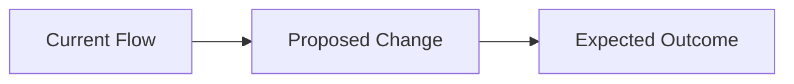

## 💡 Feature Description

A clear description of the feature or enhancement you'd like to propose.

## 🤖 Affected Skill(s)

Which skill(s) would this affect?

- [ ] Orchestration flow (forge, forge-flow, loops)
- [ ] Communication (caveman, caveman-commit, caveman-review, ste100, conventional-commits)
- [ ] Planning (wayfinder, grilling, prototype, deep-research, planning-and-task-breakdown, domain-modeling)
- [ ] Execution (using-git-worktrees, subagent-driven-development, dispatching-parallel-agents, finishing-a-development-branch, verification-before-completion, pr-review, pr-resolve, creating-pull-requests, resolving-merge-conflicts, use-git-identity)
- [ ] Bootstrap (forge-init, forge-setup, forge-docs, forge-cleanup, git-issue-tracker)
- [ ] Sidecars (12-factor-app, kiss-principle, frontend-design, forge-tailwindcss-conventions, forge-eu-accessibility, forge-seo)
- [ ] **New skill** — proposed name: ``

## 🎯 Problem Statement

What problem does this solve? What limitation have you encountered in the current skill set?

## 🔄 Flow Integration

How would this feature integrate into the existing forge flow (map → resolve → plan → work → verify → review → resolve)?

## 📋 Proposed Behavior

Describe the expected behavior in detail:

1. **Trigger:** When should this behavior activate?
2. **Input:** What context does it need?
3. **Output:** What should it produce?
4. **Handoff:** Which skills does it load or hand off to?

## 🧪 Testing Plan

How would you verify this works correctly within the full skill set?

- [ ] Loaded and exercised in Kimi Code CLI (`/skill:<name>`)
- [ ] Exercised alongside the skills it interacts with
- [ ] Verified no regression in referencing skills

## 📝 Additional Context

Any other information, examples from other tools, or reference implementations.
