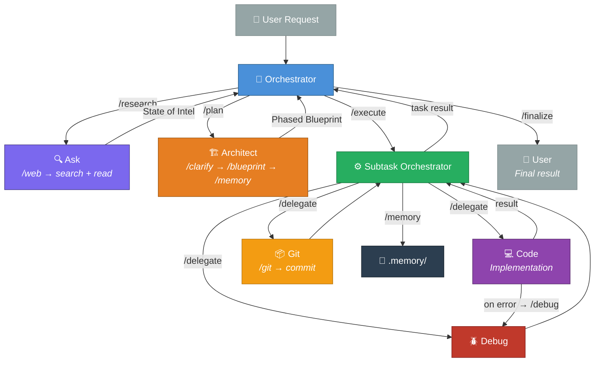
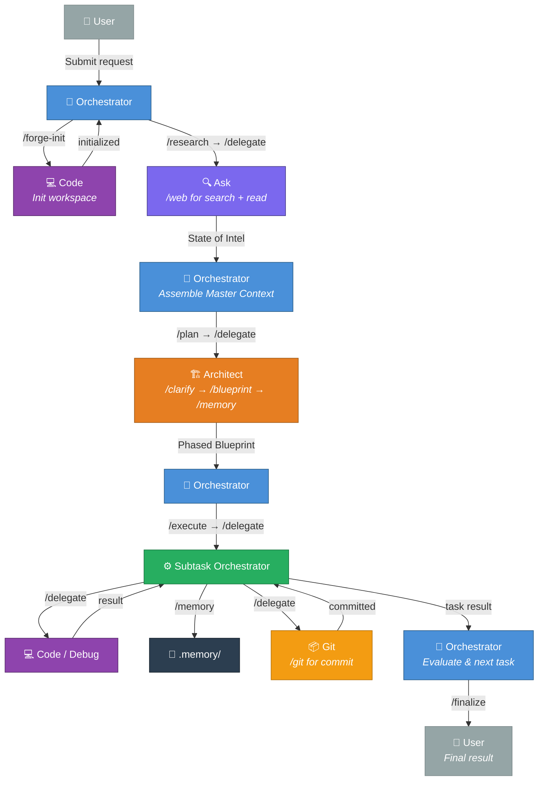
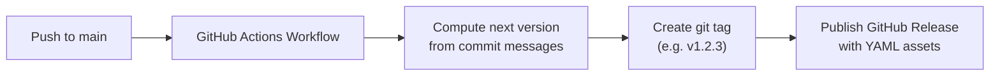

<div align="center">

# 🎯 RooForge

**A structured multi-agent orchestration system for [Roo Code](https://github.com/RooCodeInc/Roo-Code)**

A hierarchical pipeline of specialized AI modes — from strategic planning to atomic execution.

[](LICENSE)
[](../../releases/latest)
[](https://conventionalcommits.org)

</div>

---

## 📋 Overview

This project provides a curated set of **custom mode export files**, **slash commands**, and a **Forge skill** that together define a disciplined, multi-layered agent orchestration workflow for Roo Code. Each mode is a specialist with a clearly defined role, connected by standardized commands that cascade into each other to eliminate duplication.

## 🔄 The Pipeline



### Pipeline Phases

| Phase | Mode | Purpose |
|-------|------|---------|
| **1 - Intel** | Ask | Eliminate unknowns via web research & codebase analysis |
| **2 - Design** | Architect | Produce a phased Blueprint with individual tasks |
| **3 - Execute** | Orchestrator | Navigate Blueprint phases, delegate tasks sequentially |
| **4 - Atomize** | Subtask Orchestrator | Break tasks into atomic subtasks |
| **5 - Implement** | Code / Debug | Write or fix code |
| **6 - Commit** | Git | Validate, stage, and commit with conventional messages |

## 🤖 Modes

| Mode | File | Description |
|------|------|-------------|
| **Orchestrator** | [`agents/orchestrator-export.yaml`](agents/orchestrator-export.yaml) | Strategic entry point. Performs high-level task bounding, enforces the pipeline, and delegates to specialized modes. |
| **Ask** | [`agents/ask-export.yaml`](agents/ask-export.yaml) | Intelligence specialist. Performs web research, codebase analysis, and generates "State of Intel" reports. |
| **Architect** | [`agents/architect-export.yaml`](agents/architect-export.yaml) | Technical leader. Creates detailed blueprints, system designs, and structured plans from gathered intelligence. |
| **Subtask Orchestrator** | [`agents/subtask-orchestrator-export.yaml`](agents/subtask-orchestrator-export.yaml) | Execution manager. Decomposes tasks into the smallest atomic units and delegates to implementation specialists. |
| **Code** | [`agents/code-export.yaml`](agents/code-export.yaml) | Implementation specialist. Writes, modifies, and refactors code. Delegates errors to Debug mode. |
| **Git** | [`agents/git-export.yaml`](agents/git-export.yaml) | Version control specialist. Handles conventional commits, branch management, and repository integrity. |

## ⚡ Slash Commands

Standardized tool call formats that cascade into each other, eliminating duplication across agent files.

### Base Commands

| Command | Purpose |
|---------|---------|
| `/complete` | `attempt_completion` format — run when work is done |
| `/delegate` | `new_task` format — run before delegating to any mode |

### Flow Commands

| Command | Purpose | Used By |
|---------|---------|---------|
| `/clarify` | User clarification via `ask_followup_question` | Architect |
| `/blueprint` | Phased planning methodology — phases with individual tasks | Architect |
| `/finalize` | Human-readable final output | Orchestrator |

### Tool Commands

| Command | Purpose | Used By |
|---------|---------|---------|
| `/web` | Web search + URL reader via SearXNG MCP | Ask |
| `/git` | Git operations (MCP-first, CLI fallback) | Git |

### Delegation Commands (cascade to `/delegate`)

| Command | Target Mode | Purpose |
|---------|-------------|---------|
| `/research` | `ask` | Intel gathering |
| `/plan` | `architect` | Blueprint creation |
| `/execute` | `subtask-orchestrator` | Phase-based task execution |
| `/debug` | `debug` | Error resolution |
| `/memory` | `code` | Blueprint persistence |
| `/forge-init` | `code` | Project initialization |

See the **Slash Commands** section above for the command tables and cascading architecture.

## 🧠 Forge Skill + Caveman

All modes load two skills on startup:

1. **[`skills/forge/SKILL.md`](skills/forge/SKILL.md)** — Pipeline orientation: flow, command registry, mode roles, conventions
2. **[`skills/caveman/SKILL.md`](skills/caveman/SKILL.md)** — Token-efficient communication (auto-loaded by forge skill, full intensity)

Additional skill: **[`skills/planning-and-task-breakdown/SKILL.md`](skills/planning-and-task-breakdown/SKILL.md)** — Loaded by architect during `/blueprint` for structured planning methodology.

## 🧩 Mode Interaction Flow



## 🚀 Installation

### 1. Install Agent Modes

1. **Download** the export YAML files from the [latest release](../../releases/latest).
2. Open **Roo Code** in VS Code.
3. Navigate to **Roo Code Settings → Custom Modes**.
4. Click **Import** and select the downloaded `.yaml` file(s).
5. The modes will appear in your mode selector.

> **Tip:** Import all six modes for the full orchestration pipeline experience.

### 2. Install Slash Commands

Copy the commands to your Roo Code commands directory:

```bash
cp -r commands/ ~/.roo/commands/
```

### 3. Install Skills

Copy all skills to your Roo Code skills directory:

```bash
cp -r skills/ ~/.roo/skills/
```

This installs three skills:
- **forge** — Pipeline orientation (loaded by all modes on startup)
- **caveman** — Token-efficient communication (auto-loaded by forge skill)
- **planning-and-task-breakdown** — Planning methodology (loaded by `/blueprint`)

### 4. Configure MCP Servers

See [**MCP Servers**](#-mcp-servers) below for required server setup.

## 🔄 Automated Releases

This repository uses **automated semantic versioning** powered by [Conventional Commits](https://www.conventionalcommits.org/):



### Commit Convention

| Prefix | Version Bump | Example |
|--------|-------------|---------|
| `feat:` | **Minor** | `feat: add debug mode export` |
| `fix:` | **Patch** | `fix: correct orchestrator role definition` |
| `feat!:` or `BREAKING CHANGE` | **Major** | `feat!: redesign pipeline architecture` |
| `docs:` | None | `docs: update README` |
| `chore:` | None | `chore: update workflow` |
| `refactor:` | None | `refactor: simplify subtask logic` |
| `test:` | None | `test: add validation for exports` |

## 🪨 Caveman — Token-Efficient Communication

[Caveman](https://github.com/JuliusBrussee/caveman) enforces ultra-terse communication across the entire orchestration stack. Cuts ~65% of output tokens while keeping full technical accuracy. **Auto-loaded** by the Forge skill on startup** — installed as part of the skills directory (see Installation step 3).

**Manual install (if not using the skills directory):**
```bash
npx skills add JuliusBrussee/caveman
# Select "Roo Code" when prompted
```

Caveman defaults to **full** intensity. Switch levels anytime: "caveman ultra", "caveman lite", "stop caveman".

## 🔌 MCP Servers

The orchestration pipeline requires two MCP (Model Context Protocol) servers for full functionality. These servers extend the capabilities of specific modes in the pipeline.

| Server | File | Required By | Purpose |
|--------|------|-------------|---------|
| **SearXNG** | [`mcp/searxng.md`](mcp/searxng.md) | Ask | Web search & URL reading |
| **Git MCP** | [`mcp/git-mcp-server.md`](mcp/git-mcp-server.md) | Git | Git operations (CLI fallback) |

> 💡 See each server's documentation for full setup instructions, configuration details, and usage examples.

## 📁 Repository Structure

```
.
├── .github/
│   ├── workflows/
│   │   └── release.yml              # Auto-versioning & release workflow
│   └── ISSUE_TEMPLATE/              # Bug reports, features, questions
├── agents/
│   ├── orchestrator-export.yaml     # Orchestrator mode
│   ├── subtask-orchestrator-export.yaml  # Subtask Orchestrator mode
│   ├── architect-export.yaml        # Architect mode
│   ├── ask-export.yaml              # Ask (research) mode
│   ├── code-export.yaml             # Code (implementation) mode
│   └── git-export.yaml              # Git mode
├── commands/
│   ├── complete.md                  # /complete — attempt_completion format (includes blocked variant)
│   ├── delegate.md                  # /delegate — new_task format
│   ├── clarify.md                   # /clarify — user clarification protocol
│   ├── blueprint.md                 # /blueprint — phased planning methodology
│   ├── finalize.md                  # /finalize — human-readable output
│   ├── web.md                       # /web — web search + URL reader
│   ├── git.md                       # /git — git operations (MCP + CLI)
│   ├── research.md                  # /research — intel delegation
│   ├── plan.md                      # /plan — architectural grounding
│   ├── execute.md                   # /execute — phase-based task execution
│   ├── debug.md                     # /debug — error resolution
│   ├── memory.md                    # /memory — blueprint persistence
│   └── forge-init.md                # /forge-init — project initialization
├── skills/
│   ├── forge/
│   │   ├── README.md                # Forge skill overview
│   │   └── SKILL.md                 # Pipeline orientation skill
│   ├── caveman/
│   │   └── SKILL.md                 # Token-efficient communication skill
│   └── planning-and-task-breakdown/
│       └── SKILL.md                 # Planning methodology skill
├── mcp/
│   ├── searxng.md                   # SearXNG MCP server setup (Ask mode)
│   └── git-mcp-server.md            # Git MCP server setup (Git mode)
├── CONTRIBUTING.md                  # Contribution guidelines
├── LICENSE                          # Apache License 2.0
└── README.md                        # This file
```

## 🤝 Contributing

We welcome community involvement! However, please note that **pull requests are not automatically accepted**. All contributions go through an evaluation process.

See [**CONTRIBUTING.md**](CONTRIBUTING.md) for full details on:
- Our PR evaluation process
- Conventional Commits (extended) requirements
- Feature branch workflow
- Testing expectations

## 📄 License

Licensed under the [Apache License 2.0](LICENSE).

```
Copyright 2026 weselben

Licensed under the Apache License, Version 2.0 (the "License");
you may not use this file except in compliance with the License.
You may obtain a copy of the License at

    http://www.apache.org/licenses/LICENSE-2.0

Unless required by applicable law or agreed to in writing, software
distributed under the License is distributed on an "AS IS" BASIS,
WITHOUT WARRANTIES OR CONDITIONS OF ANY KIND, either express or implied.
See the License for the specific language governing permissions and
limitations under the License.
```

## ⭐ Acknowledgments

- Built for [Roo Code](https://github.com/RooCodeInc/Roo-Code) - an AI-powered coding assistant for VS Code.
- Inspired by hierarchical task decomposition and multi-agent orchestration patterns.
- [Caveman](https://github.com/JuliusBrussee/caveman) by JuliusBrussee - token-efficient communication skill for AI agents.

---

<div align="center">

**[⬆ Back to top](#-rooforge)**

</div>
