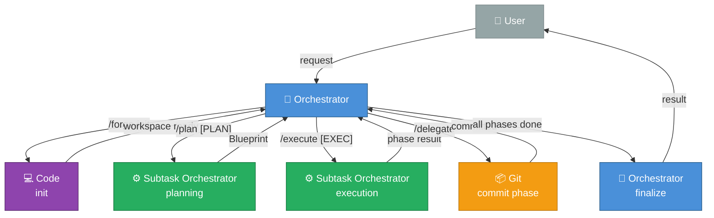
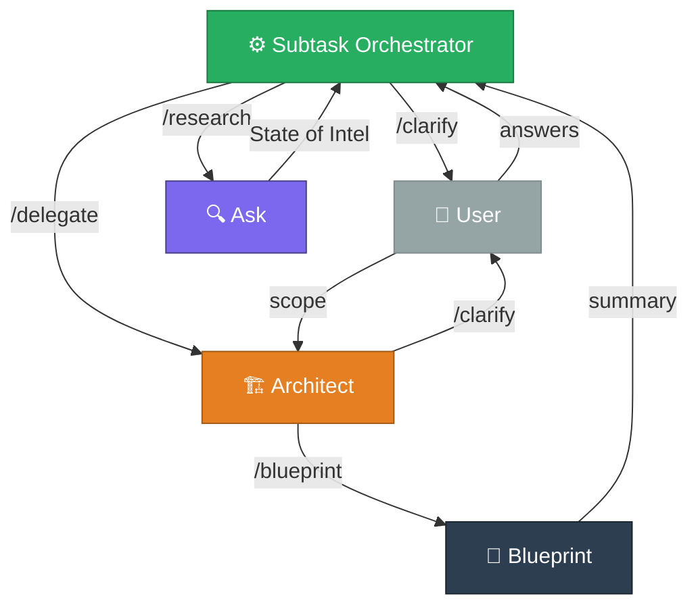
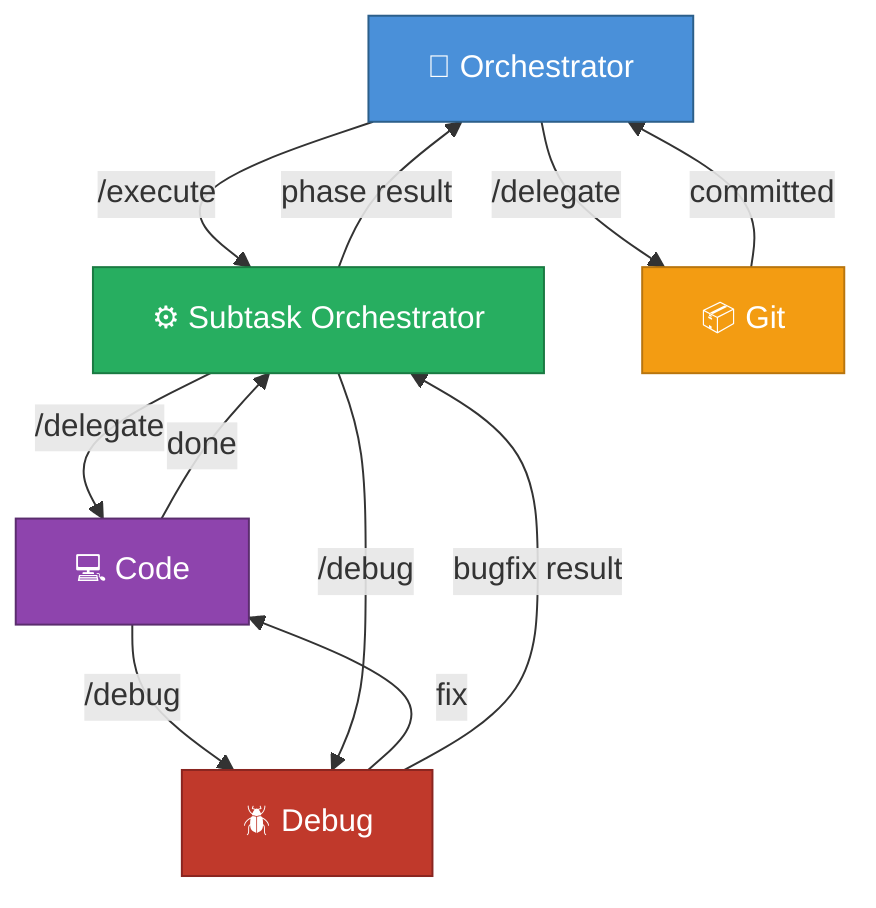

<div align="center">

# 🎯 RooForge

**A structured multi-agent orchestration system for [Zoo Code](https://github.com/Zoo-Code-Org/Zoo-Code)**

A hierarchical pipeline of specialized AI modes — from strategic planning to atomic execution.

[](LICENSE)
[](../../releases/latest)
[](https://conventionalcommits.org)

</div>

---

**Jump to:** [Overview](#-overview) · [Pipeline](#-the-pipeline) · [Modes](#-modes) · [Commands](#-slash-commands) · [Native Rules](#-native-rules) · [Installation](#-installation) · [MCP Servers](#-mcp-servers) · [Contributing](#-contributing)

---

## ⚠️ Prerequisites

Before installing, enable the **Run Slash Command** experimental feature in Zoo Code — the entire pipeline depends on it:

1. Open Zoo Code settings (gear icon)
2. Go to **Experimental Settings**
3. Enable **"Run Slash Command"**
4. Restart VS Code if prompted

> Without this setting, agents cannot execute `/plan`, `/delegate`, `/blueprint`, or any other slash command. See [run_slash_command docs](https://docs.zoocode.dev/advanced-usage/available-tools/run-slash-command) for details.

---

## 📋 Overview

This project provides a curated set of **custom mode export files**, **slash commands**, and a **Forge skill** that together define a disciplined, multi-layered agent orchestration workflow for Zoo Code. Each mode is a specialist with a clearly defined role, connected by standardized commands that cascade into each other to eliminate duplication.

## 🔄 Forge Pipeline

This project uses the Forge orchestration pipeline. All modes load the `forge` skill on startup for pipeline orientation, available commands, and role boundaries. The `caveman` skill auto-loads immediately after for token-efficient communication.

### 1. Top-Level Orchestration Tree


```mermaid
flowchart TD
    U["👤 User"] -->|"request"| O["🎯 Orchestrator"]

    O -->|"/forge-init"| INIT["💻 Code<br/>init"]
    INIT -->|"workspace ready"| O

    O -->|"/plan [PLAN]"| SO_P["⚙️ Subtask Orchestrator<br/>planning"]
    SO_P -->|"Blueprint"| O

    O -->|"/execute [EXEC]"| SO_E["⚙️ Subtask Orchestrator<br/>execution"]
    SO_E -->|"phase result"| O
    O -->|"/delegate"| G["📦 Git<br/>commit phase"]
    G -->|"committed"| O

    O -->|"all phases done"| F["🎯 Orchestrator<br/>finalize"]
    F -->|"result"| U

    style U fill:#95A5A6,color:#fff,stroke:#7F8C8D
    style O fill:#4A90D9,color:#fff,stroke:#2C5F8A
    style F fill:#4A90D9,color:#fff,stroke:#2C5F8A
    style INIT fill:#8E44AD,color:#fff,stroke:#5B2D6E
    style SO_P fill:#27AE60,color:#fff,stroke:#1A7A42
    style SO_E fill:#27AE60,color:#fff,stroke:#1A7A42
    style G fill:#F39C12,color:#fff,stroke:#B8750E
```

#### 2. Planning Phase Detail


```mermaid
flowchart TD
    SO["⚙️ Subtask Orchestrator"] -->|"/clarify"| U["👤 User"]
    U -->|"answers"| SO
    SO -->|"/research"| A["🔍 Ask"]
    A -->|"State of Intel"| SO
    SO -->|"/delegate"| AR["🏗️ Architect"]
    AR -->|"/clarify"| U
    U -->|"scope"| AR
    AR -->|"/blueprint"| B["📄 Blueprint"]
    B -->|"summary"| SO

    style U fill:#95A5A6,color:#fff,stroke:#7F8C8D
    style SO fill:#27AE60,color:#fff,stroke:#1A7A42
    style A fill:#7B68EE,color:#fff,stroke:#4B3F8A
    style AR fill:#E67E22,color:#fff,stroke:#A05A15
    style B fill:#2C3E50,color:#fff,stroke:#1A252F
```

#### 3. Execution Phase Detail


```mermaid
flowchart TB
    O["🎯 Orchestrator"] -->|"/execute"| SO["⚙️ Subtask Orchestrator"]
    SO -->|"/delegate"| C["💻 Code"]
    C -->|"/debug"| D["🪲 Debug"]
    D -->|"fix"| C
    C -->|"done"| SO
    SO -->|"phase result"| O
    O -->|"/delegate"| G["📦 Git"]
    G -->|"committed"| O
    SO -->|"/debug"| D
    D -->|"bugfix result"| SO

    style O fill:#4A90D9,color:#fff,stroke:#2C5F8A
    style SO fill:#27AE60,color:#fff,stroke:#1A7A42
    style C fill:#8E44AD,color:#fff,stroke:#5B2D6E
    style D fill:#C0392B,color:#fff,stroke:#8A2520
    style G fill:#F39C12,color:#fff,stroke:#B8750E
```

### Pipeline Phases

| Phase | Owner | Purpose |
|-------|-------|---------|
| **0 - Init** | Code | Create `.memory/`, `.gitignore`, `AGENTS.md`, and initialize git if missing |
| **1 - Plan** | Subtask Orchestrator | Clarify scope, research intel, delegate to Architect, return Blueprint |
| **2 - Execute** | Subtask Orchestrator | Decompose Blueprint tasks and delegate to Code/Debug |
| **3 - Commit** | Git | Commit each completed execution phase before the next phase starts |

### Working Memory

All modes share `.memory/` as working memory — gitignored, local only. Read via `codebase_search`, write via `/memory`.

| File Pattern | Purpose | Behavior |
|-------------|---------|----------|
| `.memory/phase-{N}-{name}.md` | One file per Blueprint phase | Append only — never duplicate |
| `.memory/research-{topic}-{date}.md` | One file per research run (ask mode) | New file per topic |
| `.memory/blocker-{desc}.md` | One file per blocker | Standalone, resolvable |
| `.memory/memory.md` | General fallback (no phase context) | Append only |
| `.memory/blueprint-{date}.md` | Auto-created by `/blueprint` | Overwrite if same date |

## 🤖 Modes

| Mode | File | Description |
|------|------|-------------|
| **Orchestrator** | [`agents/orchestrator-export.yaml`](agents/orchestrator-export.yaml) | Strategic entry point. Navigates Blueprint phases, delegates to subtask-orchestrator, and commits after each phase via Git. |
| **Ask** | [`agents/ask-export.yaml`](agents/ask-export.yaml) | Intelligence specialist. Performs web research, PDF acquisition, codebase analysis, and generates "State of Intel" reports. |
| **Architect** | [`agents/architect-export.yaml`](agents/architect-export.yaml) | Technical leader. Creates detailed blueprints, system designs, and structured plans from gathered intelligence. |
| **Subtask Orchestrator** | [`agents/subtask-orchestrator-export.yaml`](agents/subtask-orchestrator-export.yaml) | Dual-role specialist. (1) Planning: coordinates clarify → research → architect to produce Blueprint. (2) Execution: decomposes tasks into atomic subtasks for Code/Debug. |
| **Code** | [`agents/code-export.yaml`](agents/code-export.yaml) | Implementation specialist. Writes, modifies, and refactors code. Delegates errors to Debug mode. |
| **Git** | [`agents/git-export.yaml`](agents/git-export.yaml) | Version control specialist. Handles branch creation (on main), pull/sync, conventional commits with user identity. |

## ⚡ Slash Commands

Standardized tool call formats that cascade into each other, eliminating duplication across agent files.

### Base Commands

| Command | Purpose |
|---------|---------|
| `/complete` | `attempt_completion` format — run when work is done |
| `/delegate` | `new_task` format — run before delegating to any mode |

### Flow Commands

| Command | Purpose | Used By |
|---------|---------|---------|
| `/clarify` | User clarification via `ask_followup_question` (loads grill-me) | Architect, Subtask Orchestrator |
| `/blueprint` | Phased planning methodology — phases with individual tasks | Architect |
| `/planning` | Full planning lifecycle — clarify, research, architect, Blueprint | Subtask Orchestrator |
| `/finalize` | Human-readable final output | Orchestrator |

### Tool Commands

| Command | Purpose | Used By |
|---------|---------|---------|
| `/forge-init` | Project initialization — create `.memory/`, `.gitignore`, `AGENTS.md`, init git | Orchestrator |
| `/web` | Web search + URL reader via SearXNG MCP | Ask |
| `/pdf` | PDF download via curl MCP + read via pdf-reader-mcp | Ask |
| `/git` | Git operations (MCP-first, CLI fallback) | Git |

### Delegation Commands (cascade to `/delegate`)

| Command | Target Mode | Purpose |
|---------|-------------|---------|
| `/research` | `ask` | Intel gathering |
| `/plan` | `subtask-orchestrator` | Planning lifecycle (clarify → research → architect → Blueprint) |
| `/execute` | `subtask-orchestrator` | Phase-based task execution |
| `/debug` | `debug` | Error resolution |
| `/memory` | self (direct edit) | Phase-based memory persistence |
| `/forge-init` | `code` | Project initialization |

See the **Slash Commands** section above for the command tables and cascading architecture.

## 🧠 Skills

All modes load **[`skills/forge/SKILL.md`](skills/forge/SKILL.md)** on startup. It immediately loads **[`skills/caveman/SKILL.md`](skills/caveman/SKILL.md)** for token-efficient communication.

| Skill | Trigger | Purpose |
|-------|---------|---------|
| **[`skills/forge/SKILL.md`](skills/forge/SKILL.md)** | Startup, all modes | Pipeline orientation: flow, command registry, mode roles, conventions |
| **[`skills/caveman/SKILL.md`](skills/caveman/SKILL.md)** | Auto-loaded by forge | Token-efficient communication (full intensity default) |
| **[`skills/grill-me/SKILL.md`](skills/grill-me/SKILL.md)** | `/clarify` command | Relentless user interview — stress-test every design decision until shared understanding reached. **Mandatory** on every `/clarify` invocation. ([source](https://github.com/mattpocock/skills/blob/main/skills/productivity/grill-me/SKILL.md)) |
| **[`skills/planning-and-task-breakdown/SKILL.md`](skills/planning-and-task-breakdown/SKILL.md)** | `/blueprint` command | Structured planning methodology for phased task breakdown. |
| **[`skills/forge-subtask-breakdown/SKILL.md`](skills/forge-subtask-breakdown/SKILL.md)** | `[EXEC]` phase | Atomic subtask decomposition — XS-sized tasks for code mode delegation. |
| **[`skills/forge-tailwindcss-conventions/SKILL.md`](skills/forge-tailwindcss-conventions/SKILL.md)** | `/ui-ux` command | Tailwind CSS v4 coding conventions for JS frameworks (React, Vue, Nuxt 4, Svelte). |
| **[`skills/forge-eu-accessibility/SKILL.md`](skills/forge-eu-accessibility/SKILL.md)** | Mandatory on `/ui-ux` | EU legal compliance (BFSG, EAA, WCAG), framework-agnostic checklist. |
| **[`skills/frontend-design/SKILL.md`](skills/frontend-design/SKILL.md)** | `/ui-ux` command | Design philosophy, typography, color, composition, anti-generic guardrails. |
| **[`skills/forge-seo/SKILL.md`](skills/forge-seo/SKILL.md)** | `/ui-ux` or SEO code tasks | SEO hub with two references: UX/UI SEO (design → rankings) and Technical SEO (sitemaps, structured data, meta tags, rendering). Load first, then `read_file` the relevant reference. |
| **[`skills/deep-research/SKILL.md`](skills/deep-research/SKILL.md)** | Auto-loaded by ask mode (after forge) | Exhaustive deep research protocol — 10+ iteration search loop, recursive reflection, markdown-native reports. Source: moweme |
| **[`skills/conventional-commits/SKILL.md`](skills/conventional-commits/SKILL.md)** | `/git` command | Conventional Commits v1.0.0 format reference — types, SemVer mapping, breaking changes, revert rules | Project-owned |

## 📏 Native Rules

Zoo Code native rules installed to `~/.roo/rules-git/`. Loaded automatically when the rule's file pattern matches.

| Rule | Install Path | Purpose |
|------|-------------|---------|
| **[`rules/git/mandatory-commit-guardrail.md`](rules/git/mandatory-commit-guardrail.md)** | `~/.roo/rules-git/` | Git commit subject enforcement — anti-pattern detection, pipeline jargon ban, DO/DON'T guardrails. Supplements `/git`. |

## 🚀 Installation

### Install / Update (CLI)

```bash
git clone https://github.com/weselben/RooForge.git
cd RooForge
mkdir -p ~/.roo/commands ~/.roo/skills ~/.roo/rules-git ~/.roo/mcp
cp -rf commands/* ~/.roo/commands/
# Only remove known RooForge skills — never rm -rf ~/.roo/skills/* to protect user-installed skills
rm -rf ~/.roo/skills/caveman ~/.roo/skills/forge ~/.roo/skills/grill-me ~/.roo/skills/planning-and-task-breakdown ~/.roo/skills/subtask-breakdown ~/.roo/skills/forge-subtask-breakdown ~/.roo/skills/forge-tailwindcss-conventions ~/.roo/skills/frontend-design ~/.roo/skills/eu-accessibility ~/.roo/skills/forge-eu-accessibility ~/.roo/skills/conventional-commits ~/.roo/skills/seo ~/.roo/skills/forge-seo
# Only remove known RooForge rules — never rm -rf ~/.roo/rules-git/* to protect user-installed rules
rm -rf ~/.roo/rules-git/mandatory-commit-guardrail.md
rm -f ~/.roo/mcp/pdf-curl-server.sh
cp -rf skills/* ~/.roo/skills/
cp -rf rules/git/* ~/.roo/rules-git/
cp -rf mcp/* ~/.roo/mcp/
chmod +x ~/.roo/mcp/pdf-curl-server.sh
```

To install a **specific version**, clone by tag instead:

```bash
git clone --branch v1.2.3 --depth 1 https://github.com/weselben/RooForge.git
cd RooForge
mkdir -p ~/.roo/commands ~/.roo/skills ~/.roo/rules-git ~/.roo/mcp
cp -rf commands/* ~/.roo/commands/
# Only remove known RooForge skills — never rm -rf ~/.roo/skills/* to protect user-installed skills
rm -rf ~/.roo/skills/caveman ~/.roo/skills/forge ~/.roo/skills/grill-me ~/.roo/skills/planning-and-task-breakdown ~/.roo/skills/subtask-breakdown ~/.roo/skills/forge-subtask-breakdown ~/.roo/skills/forge-tailwindcss-conventions ~/.roo/skills/frontend-design ~/.roo/skills/eu-accessibility ~/.roo/skills/forge-eu-accessibility ~/.roo/skills/conventional-commits ~/.roo/skills/seo ~/.roo/skills/forge-seo
# Only remove known RooForge rules — never rm -rf ~/.roo/rules-git/* to protect user-installed rules
rm -rf ~/.roo/rules-git/mandatory-commit-guardrail.md
rm -f ~/.roo/mcp/pdf-curl-server.sh
cp -rf skills/* ~/.roo/skills/
cp -rf rules/git/* ~/.roo/rules-git/
cp -rf mcp/* ~/.roo/mcp/
chmod +x ~/.roo/mcp/pdf-curl-server.sh
```

> **Why remove specific skills, not all?** The `rm -rf` targets only known RooForge skills (`caveman`, `conventional-commits`, `forge`, `forge-eu-accessibility`, `forge-seo`, `forge-subtask-breakdown`, `frontend-design`, `grill-me`, `planning-and-task-breakdown`, `forge-tailwindcss-conventions`). This prevents accidental deletion of user-installed skills (e.g. via `npx skills add` or manual installs). If you add a new skill to this repo, **you must add it to the `rm -rf` line** in both install commands above.
>
> See [Zoo Code Slash Commands docs](https://docs.zoocode.dev/features/slash-commands), [Skills docs](https://docs.zoocode.dev/features/skills), and [Rules docs](https://docs.zoocode.dev/features/rules) for details on global directories.


### Import Agent Modes

1. **Download** the export YAML files from the [latest release](../../releases/latest).
2. Open **Zoo Code** in VS Code.
3. Navigate to **Zoo Code Settings → Custom Modes**.
4. Click **Import** and select the downloaded `.yaml` file(s).
5. The modes will appear in your mode selector.

> **Tip:** Import all six modes for the full orchestration pipeline experience.

### Configure MCP Servers

See [**MCP Servers**](#-mcp-servers) below for required server setup.

<details>
<summary>🪟 Windows Installation (PowerShell)</summary>

```powershell
# Clone the repo
$repo = "$env:USERPROFILE\RooForge"
if (-not (Test-Path $repo)) {
    git clone https://github.com/weselben/RooForge.git $repo
}

# Create directories and copy files
New-Item -ItemType Directory -Force -Path "$env:USERPROFILE\.roo\commands" | Out-Null
New-Item -ItemType Directory -Force -Path "$env:USERPROFILE\.roo\skills" | Out-Null
New-Item -ItemType Directory -Force -Path "$env:USERPROFILE\.roo\rules-git" | Out-Null
New-Item -ItemType Directory -Force -Path "$env:USERPROFILE\.roo\mcp" | Out-Null
# Copy commands (flat files)
Copy-Item -Path "$repo\commands\*" -Destination "$env:USERPROFILE\.roo\commands\" -Force

# Only remove known RooForge skills — never rm -rf ~/.roo/skills/* to protect user-installed skills
Remove-Item -Recurse -Force "$env:USERPROFILE\.roo\skills\caveman" -ErrorAction SilentlyContinue
Remove-Item -Recurse -Force "$env:USERPROFILE\.roo\skills\forge" -ErrorAction SilentlyContinue
Remove-Item -Recurse -Force "$env:USERPROFILE\.roo\skills\grill-me" -ErrorAction SilentlyContinue
Remove-Item -Recurse -Force "$env:USERPROFILE\.roo\skills\planning-and-task-breakdown" -ErrorAction SilentlyContinue
Remove-Item -Recurse -Force "$env:USERPROFILE\.roo\skills\conventional-commits" -ErrorAction SilentlyContinue

# Copy skills (with subdirectories — Get-ChildItem avoids Copy-Item wildcard flattening bug)
Get-ChildItem "$repo\skills" | ForEach-Object {
    Copy-Item -Path $_.FullName -Destination "$env:USERPROFILE\.roo\skills\" -Recurse -Force
}

# Only remove known RooForge rules
Remove-Item -Recurse -Force "$env:USERPROFILE\.roo\rules-git\mandatory-commit-guardrail.md" -ErrorAction SilentlyContinue

# Copy rules and mcp (flat files)
Copy-Item -Path "$repo\rules\git\*" -Destination "$env:USERPROFILE\.roo\rules-git\" -Force
Copy-Item -Path "$repo\mcp\*" -Destination "$env:USERPROFILE\.roo\mcp\" -Force
```

</details>

> **Windows users:** The `curl-download` MCP server also ships as a PowerShell script (`pdf-curl-server.ps1`). Copy it alongside the shell script and use the Windows config shown in [`mcp.md`](mcp.md).

## 🔄 Automated Releases

This repository uses **automated semantic versioning** powered by [Conventional Commits](https://www.conventionalcommits.org):


```mermaid
flowchart LR
    P["⬆️ Push to main"] --> W["⚙️ GitHub Actions Workflow"]
    W --> V["🔢 Compute next version<br/>from commit messages"]
    V --> T["🏷️ Create git tag<br/>(e.g. v1.2.3)"]
    T --> R["🚀 Publish GitHub Release<br/>with YAML assets"]

    style P fill:#95A5A6,color:#fff,stroke:#7F8C8D
    style W fill:#4A90D9,color:#fff,stroke:#2C5F8A
    style V fill:#E67E22,color:#fff,stroke:#A05A15
    style T fill:#27AE60,color:#fff,stroke:#1A7A42
    style R fill:#8E44AD,color:#fff,stroke:#5B2D6E
```

### Commit Convention

| Prefix | Version Bump | Example |
|--------|-------------|---------|
| `feat:` | **Minor** | `feat: add debug mode export` |
| `fix:` | **Patch** | `fix: correct orchestrator role definition` |
| `feat!:` or `BREAKING CHANGE:` | **Major** | `feat!: redesign pipeline architecture` |
| `docs:` | None | `docs: update README` |
| `style:` | None | `style: fix indentation in agent yaml` |
| `refactor:` | None | `refactor: simplify subtask logic` |
| `perf:` | None | `perf: optimize memory search` |
| `test:` | None | `test: add validation for exports` |
| `build:` | None | `build: update release workflow` |
| `ci:` | None | `ci: add linting step` |
| `chore:` | None | `chore: update workflow` |
| `revert:` | None | `revert: undo broken refactor` |

## 🔌 MCP Servers

The orchestration pipeline requires the following MCP (Model Context Protocol) servers for full functionality. These servers extend the capabilities of specific modes in the pipeline.

| Server | Required By | Purpose |
|--------|-------------|---------|
| **SearXNG** | Ask | Web search & URL reading |
| **curl-download** | Ask | PDF download from URLs (1 tool) |
| **pdf-reader-mcp** | Ask | Extract and parse text from PDFs (7 tools) |
| **Git MCP** | Git | Git operations (CLI fallback) |

> 💡 See [`mcp.md`](mcp.md) for full setup instructions, configuration details, and usage examples.

## 📁 Repository Structure

```
.
├── .github/
│   ├── workflows/
│   │   └── release.yml              # Auto-versioning & release workflow
│   └── ISSUE_TEMPLATE/              # Bug reports, features, questions
├── agents/
│   ├── orchestrator-export.yaml     # Orchestrator mode
│   ├── subtask-orchestrator-export.yaml  # Subtask Orchestrator mode
│   ├── architect-export.yaml        # Architect mode
│   ├── ask-export.yaml              # Ask (research) mode
│   ├── code-export.yaml             # Code (implementation) mode
│   └── git-export.yaml              # Git mode
├── commands/
│   ├── complete.md                  # /complete — attempt_completion format (includes blocked variant)
│   ├── delegate.md                  # /delegate — new_task format
│   ├── clarify.md                   # /clarify — user clarification protocol
│   ├── blueprint.md                 # /blueprint — phased planning methodology
│   ├── planning.md                  # /planning — SO planning lifecycle (clarify → research → architect)
│   ├── finalize.md                  # /finalize — human-readable output
│   ├── web.md                       # /web — web search + URL reader
│   ├── pdf.md                       # /pdf — PDF download via curl MCP
│   ├── git.md                       # /git — git operations (MCP + CLI + branch setup)
│   ├── research.md                  # /research — intel delegation
│   ├── plan.md                      # /plan — routing to SO for planning
│   ├── execute.md                   # /execute — phase-based task execution
│   ├── debug.md                     # /debug — error resolution
│   ├── memory.md                    # /memory — phase-based memory persistence
│   └── forge-init.md                # /forge-init — project initialization
├── rules/
│   └── git/
│       └── mandatory-commit-guardrail.md  # Git commit guardrails (installed to ~/.roo/rules-git/)
├── skills/
│   ├── forge/
│   │   ├── README.md                # Forge skill overview
│   │   └── SKILL.md                 # Pipeline orientation skill
│   ├── caveman/
│   │   └── SKILL.md                 # Token-efficient communication skill
│   ├── deep-research/
│   │   └── SKILL.md                 # Deep research protocol skill (moweme)
│   ├── conventional-commits/
│   │   └── SKILL.md                 # Conventional Commits v1.0.0 spec reference
│   ├── grill-me/
│   │   └── SKILL.md                 # Relentless user interview skill
│   ├── planning-and-task-breakdown/
│   │   └── SKILL.md                 # Planning methodology skill
│   ├── forge-subtask-breakdown/
│   │   └── SKILL.md                 # Atomic subtask decomposition skill
│   ├── forge-tailwindcss-conventions/
│   │   └── SKILL.md                 # Tailwind CSS v4 conventions for JS frameworks
│   ├── forge-seo/
│   │   ├── SKILL.md                 # SEO hub skill (UX/UI + Technical references)
│   │   └── references/              # Deep-dive reference files
│   │       ├── uxui-seo.md          # UX/UI SEO deep-dive
│   │       └── technical-seo.md     # Technical SEO deep-dive
│   ├── forge-eu-accessibility/
│   │   └── SKILL.md                 # EU accessibility compliance (BFSG, EAA, WCAG)
│   ├── frontend-design/
│   │   └── SKILL.md                 # Design philosophy, typography, color, composition
├── mcp/
│   ├── pdf-curl-server.sh          # POSIX shell script for PDF download MCP
│   └── pdf-curl-server.ps1         # PowerShell script for PDF download MCP (Windows)
├── mcp.md                          # MCP server configuration (SearXNG + curl-download + pdf-reader-mcp + Git MCP)
├── CONTRIBUTING.md                  # Contribution guidelines
├── LICENSE                          # Apache License 2.0
└── README.md                        # This file
```

## 🤝 Contributing

We welcome community involvement! However, please note that **pull requests are not automatically accepted**. All contributions go through an evaluation process.

See [**CONTRIBUTING.md**](CONTRIBUTING.md) for full details on:
- Our PR evaluation process
- Conventional Commits (extended) requirements
- Feature branch workflow
- Testing expectations

## 📄 License

Licensed under the [Apache License 2.0](LICENSE).

```
Copyright 2026 weselben

Licensed under the Apache License, Version 2.0 (the "License");
you may not use this file except in compliance with the License.
You may obtain a copy of the License at

    http://www.apache.org/licenses/LICENSE-2.0

Unless required by applicable law or agreed to in writing, software
distributed under the License is distributed on an "AS IS" BASIS,
WITHOUT WARRANTIES OR CONDITIONS OF ANY KIND, either express or implied.
See the License for the specific language governing permissions and
limitations under the License.
```

## ⭐ Acknowledgments

- Built for [Zoo Code](https://github.com/Zoo-Code-Org/Zoo-Code) - an AI-powered coding assistant for VS Code.
- Inspired by hierarchical task decomposition and multi-agent orchestration patterns.
- [Caveman](https://github.com/JuliusBrussee/caveman) by JuliusBrussee - token-efficient communication skill for AI agents.

---

<div align="center">

**[⬆ Back to top](#-rooforge)**

</div>