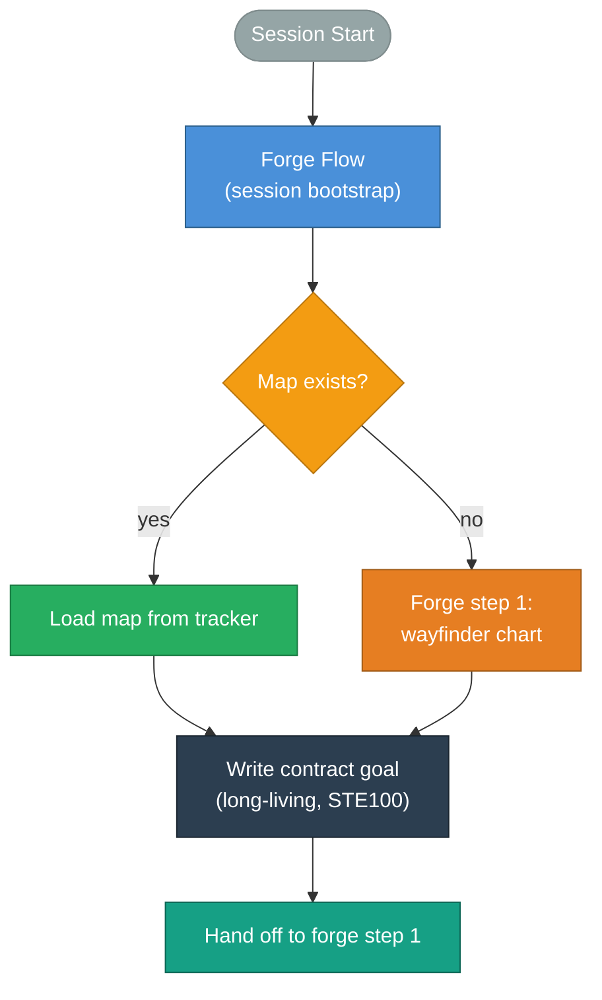
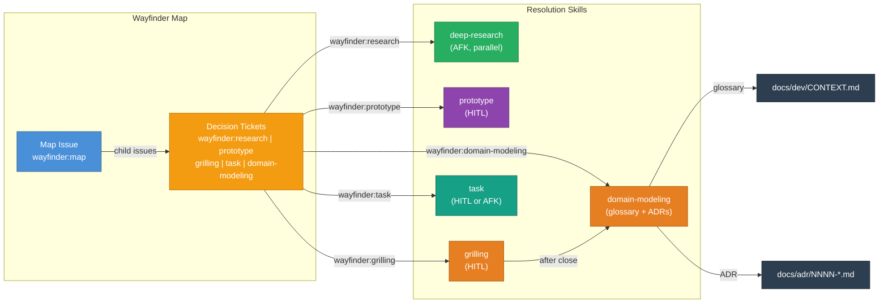
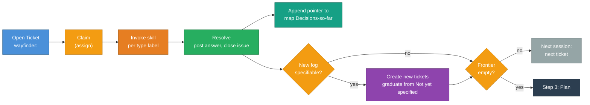
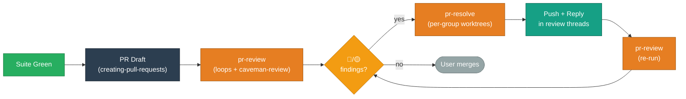

# skills-and-conventions

A curated set of AI agent **skills** for orchestrating large efforts on an issue tracker — from a loose idea to a merged PR. The repo defines the skills; the forge drives the flow; the tracker carries the map.

---

## Overview

The repo has two layers:

- **`skills/`** — 28 vendor-agnostic skills an agent loads mid-session. Communication skills (caveman, ste100, conventional-commits) govern all text. Orchestrator skills (forge, forge-flow, loops) drive the session. Planning skills (wayfinder, grilling, prototype, deep-research, planning-and-task-breakdown, domain-modeling) shape the map. Execution skills (using-git-worktrees, subagent-driven-development, dispatching-parallel-agents, finishing-a-development-branch, verification-before-completion, pr-review, pr-resolve, creating-pull-requests) build the code. Bootstrap skills (forge-init, forge-docs, forge-cleanup) maintain the repo itself.
- **`docs/`** — convention scaffolding for the artefacts the agent produces: ADRs in `docs/adr/`, system designs in `docs/system-design/`, how-to guides in `docs/guides/`, deep research artifacts in `docs/dev/agents/`. RFC-style decisions live as wayfinder tickets on the tracker, not as docs files.

---

## The Flow

Forge owns a single path: **map → resolve → plan → work → verify → review → resolve**. Each step ends on a checkable criterion; the next step is the proof.

### 1. Session Start — Forge Flow Bootstrap

Forge Flow runs before forge step 1. It prepares the work surface (branch) and the contract (goal), then hands off.


```mermaid
flowchart TD
    Start([Session Start]) --> Flow["Forge Flow<br/>(session bootstrap)"]
    Flow --> Detect{"Map exists?"}
    Detect -->|"yes"| LoadMap["Load map from tracker"]
    Detect -->|"no"| ChartMap["Forge step 1:<br/>wayfinder chart"]
    LoadMap --> Goal["Write contract goal<br/>(long-living, STE100)"]
    ChartMap --> Goal
    Goal --> Handoff["Hand off to forge step 1"]
    
    style Start fill:#95A5A6,color:#fff,stroke:#7F8C8D
    style Flow fill:#4A90D9,color:#fff,stroke:#2C5F8A
    style Detect fill:#F39C12,color:#fff,stroke:#B8750E
    style LoadMap fill:#27AE60,color:#fff,stroke:#1A7A42
    style ChartMap fill:#E67E22,color:#fff,stroke:#A05A15
    style Goal fill:#2C3E50,color:#fff,stroke:#1A252F
    style Handoff fill:#16A085,color:#fff,stroke:#0E6655
```

### 2. Map — Load or Chart the Wayfinder Map

The map is a single issue on the tracker, labelled `wayfinder:map`. Its tickets are child issues. Each ticket carries a `wayfinder:<type>` label naming the skill that resolves it.


```mermaid
flowchart LR
    subgraph Map["Wayfinder Map"]
        direction TB
        MapIssue["Map Issue<br/>wayfinder:map"]
        Tickets["Decision Tickets<br/>wayfinder:research | prototype<br/>grilling | task | domain-modeling"]
    end
    
    subgraph Skills["Resolution Skills"]
        direction TB
        Research["deep-research<br/>(AFK, parallel)"]
        Prototype["prototype<br/>(HITL)"]
        Grilling["grilling<br/>(HITL)"]
        Task["task<br/>(HITL or AFK)"]
        DomainModel["domain-modeling<br/>(glossary + ADRs)"]
    end
    
    MapIssue -->|"child issues"| Tickets
    Tickets -->|"wayfinder:research"| Research
    Tickets -->|"wayfinder:prototype"| Prototype
    Tickets -->|"wayfinder:grilling"| Grilling
    Tickets -->|"wayfinder:task"| Task
    Tickets -->|"wayfinder:domain-modeling"| DomainModel
    
    Grilling -->|"after close"| DomainModel
    DomainModel -->|"glossary"| Context["docs/dev/CONTEXT.md"]
    DomainModel -->|"ADR"| ADR["docs/adr/NNNN-*.md"]
    
    style MapIssue fill:#4A90D9,color:#fff,stroke:#2C5F8A
    style Tickets fill:#F39C12,color:#fff,stroke:#B8750E
    style Research fill:#27AE60,color:#fff,stroke:#1A7A42
    style Prototype fill:#8E44AD,color:#fff,stroke:#5B2D6E
    style Grilling fill:#E67E22,color:#fff,stroke:#A05A15
    style Task fill:#16A085,color:#fff,stroke:#0E6655
    style DomainModel fill:#E67E22,color:#fff,stroke:#A05A15
    style Context fill:#2C3E50,color:#fff,stroke:#1A252F
    style ADR fill:#2C3E50,color:#fff,stroke:#1A252F
```

### 3. Resolve — Work One Ticket

One ticket per session. Research tickets run in parallel via `dispatching-parallel-agents`. After every grilling ticket closes, `domain-modeling` sweeps for new terms and decisions.


```mermaid
flowchart LR
    Ticket["Open Ticket<br/>wayfinder:<type>"] --> Claim["Claim<br/>(assign)"]
    Claim --> Skill["Invoke skill<br/>per type label"]
    Skill --> Resolve["Resolve<br/>post answer, close issue"]
    Resolve --> Pointer["Append pointer to<br/>map Decisions-so-far"]
    Resolve --> Fog{"New fog<br/>specifiable?"}
    Fog -->|"yes"| NewTickets["Create new tickets<br/>graduate from Not yet specified"]
    Fog -->|"no"| Frontier{"Frontier<br/>empty?"}
    NewTickets --> Frontier
    Frontier -->|"no"| NextTicket["Next session:<br/>next ticket"]
    Frontier -->|"yes"| Plan["Step 3: Plan"]
    
    style Ticket fill:#4A90D9,color:#fff,stroke:#2C5F8A
    style Claim fill:#F39C12,color:#fff,stroke:#B8750E
    style Skill fill:#E67E22,color:#fff,stroke:#A05A15
    style Resolve fill:#27AE60,color:#fff,stroke:#1A7A42
    style Pointer fill:#16A085,color:#fff,stroke:#0E6655
    style Fog fill:#F39C12,color:#fff,stroke:#B8750E
    style NewTickets fill:#8E44AD,color:#fff,stroke:#5B2D6E
    style Frontier fill:#F39C12,color:#fff,stroke:#B8750E
    style NextTicket fill:#95A5A6,color:#fff,stroke:#7F8C8D
    style Plan fill:#2C3E50,color:#fff,stroke:#1A252F
```

### 4. Work — Subagent-Driven Development

When the frontier is empty, plan, then delegate to SDD. One worktree per task. One subagent per worktree. Squash-merge each task into the feat branch.


```mermaid
flowchart LR
    Plan["Plan Approved<br/>(planning-and-task-breakdown)"] --> SDD["Subagent-Driven<br/>Development"]
    SDD --> Worktrees["Create Worktrees<br/>.worktrees/<task-slug>/"]
    Worktrees --> Swarm["Dispatch Swarm<br/>(dispatching-parallel-agents)"]
    
    subgraph Wave1["Wave 1"]
        WT1["worktree/ticket-1"] --> SA1["subagent"] --> Squash1["squash → feat branch"]
    end
    
    subgraph Wave2["Wave 2 (parallel)"]
        WT2["worktree/ticket-2"] --> SA2["subagent"] --> Squash2["squash → feat branch"]
        WT3["worktree/ticket-3"] --> SA3["subagent"] --> Squash3["squash → feat branch"]
    end
    
    Swarm --> Wave1
    Swarm --> Wave2
    
    Squash1 --> Integrate["Integrate<br/>(git merge --no-ff)"]
    Squash2 --> Integrate
    Squash3 --> Integrate
    
    Integrate --> Docs["forge-docs<br/>(update indexes)"]
    Docs --> Verify["verification-before-completion<br/>(full test suite)"]
    
    style Plan fill:#27AE60,color:#fff,stroke:#1A7A42
    style SDD fill:#16A085,color:#fff,stroke:#0E6655
    style Worktrees fill:#F39C12,color:#fff,stroke:#B8750E
    style Swarm fill:#8E44AD,color:#fff,stroke:#5B2D6E
    style WT1 fill:#F39C12,color:#fff,stroke:#B8750E
    style WT2 fill:#F39C12,color:#fff,stroke:#B8750E
    style WT3 fill:#F39C12,color:#fff,stroke:#B8750E
    style SA1 fill:#8E44AD,color:#fff,stroke:#5B2D6E
    style SA2 fill:#8E44AD,color:#fff,stroke:#5B2D6E
    style SA3 fill:#8E44AD,color:#fff,stroke:#5B2D6E
    style Squash1 fill:#16A085,color:#fff,stroke:#0E6655
    style Squash2 fill:#16A085,color:#fff,stroke:#0E6655
    style Squash3 fill:#16A085,color:#fff,stroke:#0E6655
    style Integrate fill:#16A085,color:#fff,stroke:#0E6655
    style Docs fill:#E67E22,color:#fff,stroke:#A05A15
    style Verify fill:#27AE60,color:#fff,stroke:#1A7A42
```

### 5. Review — PR Draft → Review → Resolve Loop

After squash commits land, draft the PR, verify, then run the review-resolve loop until no 🔴/🟡 findings remain.


```mermaid
flowchart LR
    Verify["Suite Green"] --> PR["PR Draft<br/>(creating-pull-requests)"]
    PR --> Review["pr-review<br/>(loops + caveman-review)"]
    Review --> Findings{"🔴/🟡<br/>findings?"}
    Findings -->|"yes"| Resolve["pr-resolve<br/>(per-group worktrees)"]
    Resolve --> Push["Push + Reply<br/>in review threads"]
    Push --> ReReview["pr-review<br/>(re-run)"]
    ReReview --> Findings
    Findings -->|"no"| Merge(["User merges"])
    
    style Verify fill:#27AE60,color:#fff,stroke:#1A7A42
    style PR fill:#2C3E50,color:#fff,stroke:#1A252F
    style Review fill:#E67E22,color:#fff,stroke:#A05A15
    style Findings fill:#F39C12,color:#fff,stroke:#B8750E
    style Resolve fill:#E67E22,color:#fff,stroke:#A05A15
    style Push fill:#16A085,color:#fff,stroke:#0E6655
    style ReReview fill:#E67E22,color:#fff,stroke:#A05A15
    style Merge fill:#95A5A6,color:#fff,stroke:#7F8C8D
```

### 6. File Artefacts Per Step

Each forge step emits concrete files. The table below shows what gets written where.

| Step | Artefact | Location |
|------|----------|----------|
| 1. Map | Labels `wayfinder:*` | GitHub labels |
| 1. Map | Map + ticket issues | GitHub tracker |
| 2. Resolve | Glossary terms | `docs/dev/CONTEXT.md` |
| 2. Resolve | ADRs | `docs/adr/NNNN-*.md` |
| 2. Resolve | Research reports | `docs/dev/agents/<topic>.md` |
| 3. Plan | Plan file | plan mode output |
| 4. Work | Worktrees | `.worktrees/<task-slug>/` |
| 4. Work | Feat branch | `feat/wayfinder-<map>` |
| 5. PR | PR draft | `gh api` |
| 7. Review | Inline comments | PR review threads |
| 8. Resolve | Resolver worktrees | `.worktrees/<finding>/` |

---

## Skills

| Skill | Purpose | Load | Source | Guide |
|-------|---------|------|--------|-------|
| [`skills/forge/SKILL.md`](skills/forge/SKILL.md) | Session-start orchestrator: map → resolve → plan → work → verify → review → resolve | **always** | local | [`docs/guides/forge.md`](docs/guides/forge.md) |
| [`skills/forge-flow/SKILL.md`](skills/forge-flow/SKILL.md) | Session bootstrap: feat branch from main, harness goal, hand off to forge step 1 | **always** | local | [`docs/guides/forge-flow.md`](docs/guides/forge-flow.md) |
| [`skills/forge-init/SKILL.md`](skills/forge-init/SKILL.md) | Bootstrap a repo to be forge-ready: AGENTS.md contract, grilling for repo-specifics | one-shot | local | [`docs/guides/forge-init.md`](docs/guides/forge-init.md) |
| [`skills/forge-docs/SKILL.md`](skills/forge-docs/SKILL.md) | Maintain the docs directory — structure, update rules, index files, ADR mandate | on-demand | local | [`docs/guides/forge-docs.md`](docs/guides/forge-docs.md) |
| [`skills/forge-cleanup/SKILL.md`](skills/forge-cleanup/SKILL.md) | Remove stale forge artefacts — scratch files, worktrees, uncommitted changes, local branches | one-shot | local | [`docs/guides/forge-cleanup.md`](docs/guides/forge-cleanup.md) |
| [`skills/wayfinder/SKILL.md`](skills/wayfinder/SKILL.md) | Plan a huge effort as a shared map of decision tickets on the issue tracker | **always** | [mattpocock/skills](https://github.com/mattpocock/skills/blob/main/skills/engineering/wayfinder/SKILL.md) | [`docs/guides/wayfinder.md`](docs/guides/wayfinder.md) |
| [`skills/caveman/SKILL.md`](skills/caveman/SKILL.md) | Ultra-compressed chat replies — drop articles/filler, keep technical accuracy | **always** | [JuliusBrussee/caveman](https://github.com/JuliusBrussee/caveman/tree/main/skills/caveman) | [`docs/guides/caveman.md`](docs/guides/caveman.md) |
| [`skills/grilling/SKILL.md`](skills/grilling/SKILL.md) | Grill the user relentlessly — design-tree frontier, max 4 questions per wave | on-demand | [mattpocock/skills](https://github.com/mattpocock/skills/blob/main/skills/productivity/grilling/SKILL.md) | [`docs/guides/grilling.md`](docs/guides/grilling.md) |
| [`skills/prototype/SKILL.md`](skills/prototype/SKILL.md) | Build a throwaway prototype to answer a design question | on-demand | [mattpocock/skills](https://github.com/mattpocock/skills/blob/main/skills/engineering/prototype/SKILL.md) | [`docs/guides/prototype.md`](docs/guides/prototype.md) |
| [`skills/deep-research/SKILL.md`](skills/deep-research/SKILL.md) | Exhaustive evidence-based research — 10+ iteration search loop, markdown-native reports | on-demand | [MoweME](https://github.com/MoweME) | [`docs/guides/deep-research.md`](docs/guides/deep-research.md) |
| [`skills/domain-modeling/SKILL.md`](skills/domain-modeling/SKILL.md) | Build and sharpen the domain model: CONTEXT.md glossary + ADRs in `docs/adr/` | on-demand | [mattpocock/skills](https://github.com/mattpocock/skills/blob/main/skills/engineering/domain-modeling/SKILL.md) | [`docs/guides/domain-modeling.md`](docs/guides/domain-modeling.md) |
| [`skills/git-issue-tracker/SKILL.md`](skills/git-issue-tracker/SKILL.md) | Wrap the GitHub API for issue/sub-issue/dependency operations used by wayfinder | on-demand | local | [`docs/guides/git-issue-tracker.md`](docs/guides/git-issue-tracker.md) |
| [`skills/planning-and-task-breakdown/SKILL.md`](skills/planning-and-task-breakdown/SKILL.md) | Break a spec into ordered, implementable tasks with parallel work identified | on-demand | local | [`docs/guides/planning-and-task-breakdown.md`](docs/guides/planning-and-task-breakdown.md) |
| [`skills/using-git-worktrees/SKILL.md`](skills/using-git-worktrees/SKILL.md) | Create one worktree per task, commits inside, cleanup by coordinator | on-demand | [obra/superpowers](https://github.com/obra/superpowers/tree/main/skills/using-git-worktrees) | [`docs/guides/using-git-worktrees.md`](docs/guides/using-git-worktrees.md) |
| [`skills/dispatching-parallel-agents/SKILL.md`](skills/dispatching-parallel-agents/SKILL.md) | AgentSwarm mechanics: dispatch up to 10 parallel subagents via `{{item}}` prompt template | on-demand | [obra/superpowers](https://github.com/obra/superpowers/tree/main/skills/dispatching-parallel-agents) | [`docs/guides/dispatching-parallel-agents.md`](docs/guides/dispatching-parallel-agents.md) |
| [`skills/subagent-driven-development/SKILL.md`](skills/subagent-driven-development/SKILL.md) | Coordinator dispatch → per-task review → fix loop → integrate. One worktree per task | on-demand | [obra/superpowers](https://github.com/obra/superpowers/tree/main/skills/subagent-driven-development) | [`docs/guides/subagent-driven-development.md`](docs/guides/subagent-driven-development.md) |
| [`skills/finishing-a-development-branch/SKILL.md`](skills/finishing-a-development-branch/SKILL.md) | Push + PR creation path; merge conflicts load `resolving-merge-conflicts` | on-demand | [obra/superpowers](https://github.com/obra/superpowers/tree/main/skills/finishing-a-development-branch) | [`docs/guides/finishing-a-development-branch.md`](docs/guides/finishing-a-development-branch.md) |
| [`skills/verification-before-completion/SKILL.md`](skills/verification-before-completion/SKILL.md) | Iron Law: NO COMPLETION CLAIMS WITHOUT FRESH VERIFICATION EVIDENCE | on-demand | [obra/superpowers](https://github.com/obra/superpowers/tree/main/skills/verification-before-completion) | [`docs/guides/verification-before-completion.md`](docs/guides/verification-before-completion.md) |
| [`skills/pr-review/SKILL.md`](skills/pr-review/SKILL.md) | Validate → review loop → post ONE review (caveman-review findings) inside a worktree | on-demand | local | [`docs/guides/pr-review.md`](docs/guides/pr-review.md) |
| [`skills/pr-resolve/SKILL.md`](skills/pr-resolve/SKILL.md) | Findings → fix → push → thread replies (loop until no 🔴/🟡) | on-demand | local | [`docs/guides/pr-resolve.md`](docs/guides/pr-resolve.md) |
| [`skills/loops/SKILL.md`](skills/loops/SKILL.md) | Shell framework: render prompt template, cavemanize, drive `kimi -p` until DONE:/BLOCKED: | on-demand | local | [`docs/guides/loops.md`](docs/guides/loops.md) |
| [`skills/creating-pull-requests/SKILL.md`](skills/creating-pull-requests/SKILL.md) | Size-gated PR descriptions with mandatory AI disclosure (prose per `ste100`) | on-demand | [tdhopper/dotfiles2.0](https://github.com/tdhopper/dotfiles2.0/blob/master/.claude/skills/creating-pull-requests/SKILL.md) | [`docs/guides/creating-pull-requests.md`](docs/guides/creating-pull-requests.md) |
| [`skills/caveman-review/SKILL.md`](skills/caveman-review/SKILL.md) | Ultra-compressed code review comments: location, problem, fix — one line per finding | on-demand | local | [`docs/guides/caveman-review.md`](docs/guides/caveman-review.md) |
| [`skills/ste100/SKILL.md`](skills/ste100/SKILL.md) | Write human-facing text in ASD-STE100 Simplified Technical English | on-demand | local | [`docs/guides/ste100.md`](docs/guides/ste100.md) |
| [`skills/caveman-commit/SKILL.md`](skills/caveman-commit/SKILL.md) | Ultra-compressed commit messages in Conventional Commits format | on-demand | [JuliusBrussee/caveman](https://github.com/JuliusBrussee/caveman/tree/main/skills/caveman-commit) | [`docs/guides/caveman-commit.md`](docs/guides/caveman-commit.md) |
| [`skills/conventional-commits/SKILL.md`](skills/conventional-commits/SKILL.md) | Conventional Commits v1.0.0 spec — type→SemVer table | on-demand | [weselben/RooForge](https://github.com/weselben/RooForge/tree/main/skills/conventional-commits) | [`docs/guides/conventional-commits.md`](docs/guides/conventional-commits.md) |
| [`skills/use-git-identity/SKILL.md`](skills/use-git-identity/SKILL.md) | Set git identity before any commit/amend/rebase | on-demand | local (host convention) | [`docs/guides/use-git-identity.md`](docs/guides/use-git-identity.md) |
| [`skills/resolving-merge-conflicts/SKILL.md`](skills/resolving-merge-conflicts/SKILL.md) | Resolve git merge/rebase conflicts; multi-branch conflicts delegate to SDD | on-demand | [mattpocock/skills](https://github.com/mattpocock/skills/blob/main/skills/engineering/resolving-merge-conflicts/SKILL.md) | [`docs/guides/resolving-merge-conflicts.md`](docs/guides/resolving-merge-conflicts.md) |

---

## Repository Structure

```
.
├── docs/
│   ├── README.md           # Global docs index
│   ├── adr/                # Architecture Decision Records
│   ├── dev/
│   │   ├── README.md       # dev subfolder index
│   │   ├── CONTEXT.md      # Domain glossary (ADR index)
│   │   └── agents/         # Deep research reports
│   ├── guides/
│   │   ├── README.md       # guides subfolder index
│   │   └── <skill>.md      # One reference guide per skill (28 total)
│   ├── public/
│   │   └── README.md       # public subfolder index
│   └── system-design/
│       └── README.md       # system-design subfolder index
├── skills/
│   ├── caveman/
│   ├── caveman-commit/
│   ├── caveman-review/
│   ├── conventional-commits/
│   ├── creating-pull-requests/
│   ├── deep-research/
│   ├── dispatching-parallel-agents/
│   ├── domain-modeling/
│   ├── finishing-a-development-branch/
│   ├── forge/                # the orchestrator
│   ├── forge-cleanup/
│   ├── forge-docs/
│   ├── forge-flow/
│   ├── forge-init/
│   ├── git-issue-tracker/
│   ├── grilling/
│   ├── loops/
│   ├── planning-and-task-breakdown/
│   ├── pr-resolve/
│   ├── pr-review/
│   ├── prototype/
│   ├── resolving-merge-conflicts/
│   ├── ste100/
│   ├── subagent-driven-development/
│   ├── use-git-identity/
│   ├── using-git-worktrees/
│   ├── verification-before-completion/
│   └── wayfinder/
├── src/                  # reserved
├── tests/                # reserved
├── AGENTS.md             # Local agent contract (letter style)
└── README.md             # this file
```

---

## Docs

Every skill ships with a one-page reference guide under [`docs/guides/`](docs/guides/README.md) — the index links all 28. The global docs index at [`docs/README.md`](docs/README.md) covers the rest: [`docs/dev/CONTEXT.md`](docs/dev/CONTEXT.md) (domain glossary + ADR index), [`docs/adr/`](docs/adr/) (architecture decisions), [`docs/system-design/`](docs/system-design/README.md), [`docs/public/`](docs/public/README.md), and [`docs/dev/agents/`](docs/dev/agents/) (deep research reports).

A local agent contract lives at [`AGENTS.md`](AGENTS.md) — letter style, scoped to this repo's conventions.

---

## Invariant Rules

These rules bind every session where forge is active:

- **Mandates are mandatory.** When any skill uses *must*, *mandatory*, *MUST*, or *always*, follow it exactly.
- **caveman is default.** caveman(ultra) is active every response. Off only on explicit "stop caveman" / "normal mode".
- **Own repos only.** Forge operates only in repos owned by the user's git identity.
- **Single path.** One flow through the steps. No branching in the orchestrator.
- **Forge Flow first.** `forge-flow` runs before step 1: creates the feat branch from `main`, sets the harness goal, hands off.
