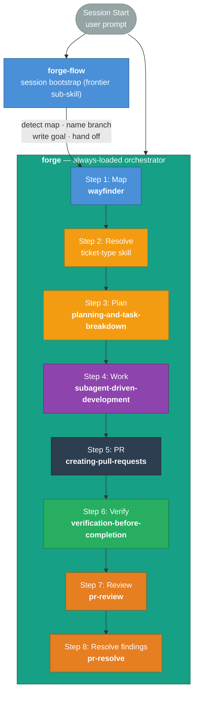
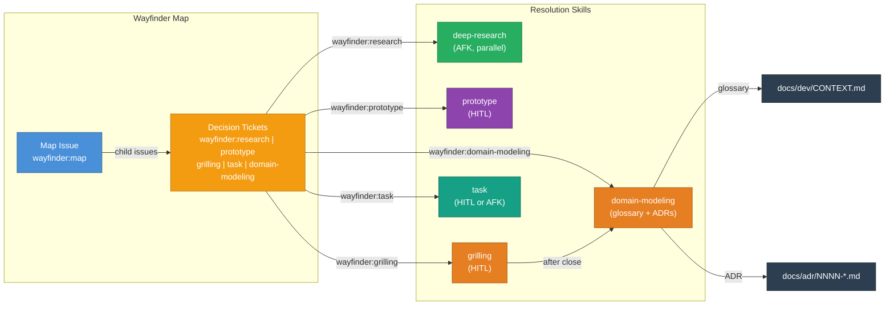
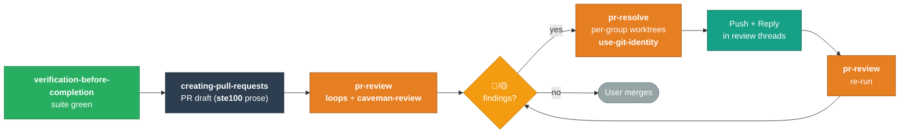

# RooForge

A curated set of AI agent **skills** for orchestrating large efforts on an issue tracker — from a loose idea to a merged PR. The repo defines the skills; the forge drives the flow; the tracker carries the map.

---

## Overview

The repo has two layers:

- **`skills/`** — 29 vendor-agnostic skills an agent loads mid-session. Communication skills (caveman, ste100, conventional-commits) govern all text. Orchestrator skills (forge, forge-flow, loops) drive the session. Planning skills (wayfinder, grilling, prototype, deep-research, planning-and-task-breakdown, domain-modeling) shape the map. Execution skills (using-git-worktrees, subagent-driven-development, dispatching-parallel-agents, finishing-a-development-branch, verification-before-completion, pr-review, pr-resolve, creating-pull-requests) build the code. Bootstrap skills (forge-init, forge-setup, forge-docs, forge-cleanup) maintain the repo itself.
- **`docs/`** — convention scaffolding for the artefacts the agent produces: ADRs in `docs/adr/`, system designs in `docs/system-design/`, how-to guides in `docs/guides/`, deep research artifacts in `docs/dev/agents/`. RFC-style decisions live as wayfinder tickets on the tracker, not as docs files.

---

## Install — copy this prompt to your agent

```text
Install the forge-setup skill from the raw URL below into my harness's skill directory (preferred: `<harness-config-dir>/skills/forge-setup/SKILL.md`; fallback: `~/.agents/skills/forge-setup/SKILL.md`), then load it in this chat and run it. The skill handles everything: it clones this repo to a temp directory, identifies the running harness, discovers and patches all non-harness-agnostic references, verifies the adapted skills, and optionally installs them into the harness skill directory.
```

Raw skill URL:
```
https://raw.githubusercontent.com/weselben/RooForge/main/skills/forge-setup/SKILL.md
```

After forge-setup completes, invoke `forge-init` by name (once per repo — it is user-invoked, not auto-triggered). Then just start working: write something like "work on the next ticket" or "let's continue the auth refactor". The always-loaded `forge` skill auto-triggers on that, invokes `forge-flow` to bootstrap the session (branch + goal), and runs the full flow from there.

---

## Prerequisites

The skills in this repo have the following external dependencies. Ensure these are available on your system before running the corresponding skills.

| Skill | Required tools / dependencies |
|-------|-------------------------------|
| **forge**, **forge-flow**, **wayfinder**, **git-issue-tracker**, **creating-pull-requests**, **pr-review**, **pr-resolve**, **finishing-a-development-branch** | `gh` (GitHub CLI, ≥2.0), authenticated (`gh auth status`) |
| **forge-init**, **wayfinder** | `gh` + `gh api` (label creation, sub-issue wiring) |
| **loops**, **pr-review**, **pr-resolve** | `bash` (POSIX), `kimi -p` (or harness equivalent after forge-setup) |
| **using-git-worktrees**, **subagent-driven-development**, **finishing-a-development-branch** | `git` (≥2.20 for `git worktree`), project test runner (`npm test` / `cargo test` / `pytest` / `go test ./...`) |
| **using-git-worktrees** | Project package manager if `package.json` exists (`npm`/`pnpm`/`yarn`) |
| **deep-research** | Web search capability (harness tool or `curl` + `jq` for API fallback) |
| **dispatching-parallel-agents**, **subagent-driven-development** | Harness subagent API (`AgentSwarm`, `Agent`, `run_in_background`, `subagent_type: coder/explore/plan`) — **adapted by forge-setup** |
| **forge-flow** | Harness goal API (`CreateGoal`) or file fallback (`GOAL.md`) — **adapted by forge-setup** |
| **planning-and-task-breakdown**, **forge** | Harness plan mode (`EnterPlanMode`/`ExitPlanMode`) — **adapted by forge-setup** |
| **caveman**, **caveman-commit**, **caveman-review**, **ste100**, **conventional-commits**, **grilling**, **prototype**, **domain-modeling**, **verification-before-completion**, **resolving-merge-conflicts**, **use-git-identity**, **forge-init**, **forge-docs**, **forge-cleanup**, **forge-setup** | No external tools (pure prompt contracts) |

> **Note:** Skills marked **adapted by forge-setup** reference Kimi-specific machinery (`CreateGoal`, `EnterPlanMode`, `AgentSwarm`, `kimi -p`). The `forge-setup` skill (run once after cloning on a non-Kimi harness) discovers and patches these to the harness's equivalents. Until forge-setup runs, those skills will reference unavailable Kimi APIs.

---

## The Flow

Forge owns a single path: **map → resolve → plan → work → verify → review → resolve**. Each step ends on a checkable criterion; the next step is the proof. `forge` is the always-loaded orchestrator — it auto-triggers on session prompts like "work on the next ticket" and invokes `forge-flow` once at session start to bootstrap branch and goal before step 1.

Each step is driven by one skill and supported by others:

| Step | Driving skill | Supporting skills |
|------|---------------|-------------------|
| 0. Bootstrap | `forge-flow` | `ste100` |
| 1. Map | `wayfinder` | `git-issue-tracker`, `grilling`, `domain-modeling`, `deep-research`, `dispatching-parallel-agents` |
| 2. Resolve | the ticket's type skill (`grilling` / `prototype` / `deep-research` / task) | `domain-modeling` (sweep after every close) |
| 3. Plan | `planning-and-task-breakdown` | — |
| 4. Work | `subagent-driven-development` | `using-git-worktrees`, `dispatching-parallel-agents`, `conventional-commits`, `caveman-commit`, `forge-docs`, `resolving-merge-conflicts` |
| 5. PR | `creating-pull-requests` | `ste100` |
| 6. Verify | `verification-before-completion` | — |
| 7. Review | `pr-review` | `loops`, `caveman-review` |
| 8. Resolve findings | `pr-resolve` | `use-git-identity`, `loops`, `resolving-merge-conflicts` |

Always-on regardless of step: `forge` (orchestrator), `caveman` (ultra), `wayfinder`.

### 1. Session Start — Forge loads, forge-flow bootstraps

The user opens a chat and writes something like "work on the next ticket", "let's continue the auth refactor", or simply describes a task. The **`forge`** skill is always-loaded and auto-triggers on these prompts. It invokes **`forge-flow`** once at session start as a frontier sub-skill: forge-flow detects whether a wayfinder map exists, prepares the feat branch from `main`, writes the long-living contract goal, and hands off to forge step 1. Then forge's own step 1 either loads the existing map or charts a new one through `wayfinder`.


```mermaid
flowchart TD
    subgraph Forge["<b>forge</b> — always-loaded orchestrator"]
        direction TB
        F1["Step 1: Map<br/><b>wayfinder</b>"]
        F2["Step 2: Resolve<br/>ticket-type skill"]
        F3["Step 3: Plan<br/><b>planning-and-task-breakdown</b>"]
        F4["Step 4: Work<br/><b>subagent-driven-development</b>"]
        F5["Step 5: PR<br/><b>creating-pull-requests</b>"]
        F6["Step 6: Verify<br/><b>verification-before-completion</b>"]
        F7["Step 7: Review<br/><b>pr-review</b>"]
        F8["Step 8: Resolve findings<br/><b>pr-resolve</b>"]
        F1 --> F2 --> F3 --> F4 --> F5 --> F6 --> F7 --> F8
    end

    Start([Session Start<br/>user prompt]) --> Forge
    Start --> FF["<b>forge-flow</b><br/>session bootstrap (frontier sub-skill)"]
    FF -->|"detect map · name branch<br/>write goal · hand off"| F1

    style Start fill:#95A5A6,color:#fff,stroke:#7F8C8D
    style Forge fill:#16A085,color:#fff,stroke:#0E6655
    style FF fill:#4A90D9,color:#fff,stroke:#2C5F8A
    style F1 fill:#4A90D9,color:#fff,stroke:#2C5F8A
    style F2 fill:#F39C12,color:#fff,stroke:#B8750E
    style F3 fill:#F39C12,color:#fff,stroke:#B8750E
    style F4 fill:#8E44AD,color:#fff,stroke:#5B2D6E
    style F5 fill:#2C3E50,color:#fff,stroke:#1A252F
    style F6 fill:#27AE60,color:#fff,stroke:#1A7A42
    style F7 fill:#E67E22,color:#fff,stroke:#A05A15
    style F8 fill:#E67E22,color:#fff,stroke:#A05A15
```

`forge-flow` does not load the map itself — it only detects whether one exists. The actual map load happens in forge step 1 (section 2 below).

### 2. Map — Load or Chart the Wayfinder Map

The map is a single issue on the tracker, labelled `wayfinder:map`. Its tickets are child issues; each ticket carries a `wayfinder:<type>` label naming the skill that resolves it. If a map already exists, `wayfinder` loads it; if not, it enters chart mode (grilling + domain-modeling) and creates one. Sub-skills involved: **`git-issue-tracker`** for the GitHub operations, **`grilling`** to draw out the destination, **`domain-modeling`** to seed the glossary, **`deep-research`** for AFK research tickets, and **`dispatching-parallel-agents`** to chart fog patches in parallel.


```mermaid
flowchart LR
    subgraph Map["Wayfinder Map"]
        direction TB
        MapIssue["Map Issue<br/>wayfinder:map"]
        Tickets["Decision Tickets<br/>wayfinder:research | prototype<br/>grilling | task | domain-modeling"]
    end
    
    subgraph Skills["Resolution Skills"]
        direction TB
        Research["deep-research<br/>(AFK, parallel)"]
        Prototype["prototype<br/>(HITL)"]
        Grilling["grilling<br/>(HITL)"]
        Task["task<br/>(HITL or AFK)"]
        DomainModel["domain-modeling<br/>(glossary + ADRs)"]
    end
    
    MapIssue -->|"child issues"| Tickets
    Tickets -->|"wayfinder:research"| Research
    Tickets -->|"wayfinder:prototype"| Prototype
    Tickets -->|"wayfinder:grilling"| Grilling
    Tickets -->|"wayfinder:task"| Task
    Tickets -->|"wayfinder:domain-modeling"| DomainModel
    
    Grilling -->|"after close"| DomainModel
    DomainModel -->|"glossary"| Context["docs/dev/CONTEXT.md"]
    DomainModel -->|"ADR"| ADR["docs/adr/NNNN-*.md"]
    
    style MapIssue fill:#4A90D9,color:#fff,stroke:#2C5F8A
    style Tickets fill:#F39C12,color:#fff,stroke:#B8750E
    style Research fill:#27AE60,color:#fff,stroke:#1A7A42
    style Prototype fill:#8E44AD,color:#fff,stroke:#5B2D6E
    style Grilling fill:#E67E22,color:#fff,stroke:#A05A15
    style Task fill:#16A085,color:#fff,stroke:#0E6655
    style DomainModel fill:#E67E22,color:#fff,stroke:#A05A15
    style Context fill:#2C3E50,color:#fff,stroke:#1A252F
    style ADR fill:#2C3E50,color:#fff,stroke:#1A252F
```

### 3. Resolve — Work One Ticket

One ticket per session. **`wayfinder`** claims the next frontier ticket (assigns it), the ticket's `wayfinder:<type>` label names the resolution skill (grilling, prototype, deep-research, or a task), and on close `domain-modeling` sweeps for new glossary terms and decisions worth an ADR. Sub-skills: **`dispatching-parallel-agents`** may run multiple research tickets in parallel; the next session picks up the next frontier ticket or, when the frontier empties, hands off to step 3 (plan).


```mermaid
flowchart LR
    Ticket["Open Ticket<br/>wayfinder:<type>"] --> Claim["<b>wayfinder</b><br/>claim (assign)"]
    Claim --> Skill["<b>grilling</b> / <b>prototype</b> /<br/><b>deep-research</b> / task<br/>per type label"]
    Skill --> Resolve["Resolve<br/>post answer, close issue"]
    Resolve --> Sweep["<b>domain-modeling</b><br/>glossary + ADR sweep"]
    Sweep --> Pointer["<b>wayfinder</b><br/>append pointer to<br/>map Decisions-so-far"]
    Pointer --> Fog{"New fog<br/>specifiable?"}
    Fog -->|"yes"| NewTickets["<b>wayfinder</b><br/>create new tickets<br/>graduate from Not yet specified"]
    Fog -->|"no"| Frontier{"Frontier<br/>empty?"}
    NewTickets --> Frontier
    Frontier -->|"no"| NextTicket["Next session:<br/>next ticket"]
    Frontier -->|"yes"| Plan["Step 3: <b>planning-and-task-breakdown</b>"]
    
    style Ticket fill:#4A90D9,color:#fff,stroke:#2C5F8A
    style Claim fill:#F39C12,color:#fff,stroke:#B8750E
    style Skill fill:#E67E22,color:#fff,stroke:#A05A15
    style Resolve fill:#27AE60,color:#fff,stroke:#1A7A42
    style Sweep fill:#E67E22,color:#fff,stroke:#A05A15
    style Pointer fill:#16A085,color:#fff,stroke:#0E6655
    style Fog fill:#F39C12,color:#fff,stroke:#B8750E
    style NewTickets fill:#8E44AD,color:#fff,stroke:#5B2D6E
    style Frontier fill:#F39C12,color:#fff,stroke:#B8750E
    style NextTicket fill:#95A5A6,color:#fff,stroke:#7F8C8D
    style Plan fill:#2C3E50,color:#fff,stroke:#1A252F
```

### 4. Work — Subagent-Driven Development

When the frontier empties, **`planning-and-task-breakdown`** breaks the cleared map into ordered tasks and the user approves the plan in plan mode. Then **`subagent-driven-development`** takes over as coordinator: it creates one worktree per task via **`using-git-worktrees`** (under `.worktrees/<task-slug>/`), dispatches all implementer subagents in a single **`dispatching-parallel-agents`** swarm call (each runs `using-git-worktrees` + `conventional-commits` + `caveman-commit` + `verification-before-completion`), reviews each task's diff, runs the fix loop until clean, and merges each branch into the feat branch with `git merge --no-ff`. Conflicts route through **`resolving-merge-conflicts`**. After every squash, **`forge-docs`** updates the docs indexes.


```mermaid
flowchart LR
    Plan["Plan Approved<br/><b>planning-and-task-breakdown</b>"] --> SDD["<b>subagent-driven-development</b><br/>coordinator"]
    SDD --> Worktrees["<b>using-git-worktrees</b><br/>.worktrees/<task-slug>/"]
    Worktrees --> Swarm["<b>dispatching-parallel-agents</b><br/>one AgentSwarm call"]
    
    subgraph Wave1["Wave 1"]
        WT1["worktree/ticket-1"] --> SA1["subagent<br/><b>conventional-commits</b>"] --> Squash1["squash → feat branch"]
    end
    
    subgraph Wave2["Wave 2 (parallel)"]
        WT2["worktree/ticket-2"] --> SA2["subagent<br/><b>conventional-commits</b>"] --> Squash2["squash → feat branch"]
        WT3["worktree/ticket-3"] --> SA3["subagent<br/><b>conventional-commits</b>"] --> Squash3["squash → feat branch"]
    end
    
    Swarm --> Wave1
    Swarm --> Wave2
    
    Squash1 --> Integrate["Integrate<br/>(git merge --no-ff)<br/>conflicts → <b>resolving-merge-conflicts</b>"]
    Squash2 --> Integrate
    Squash3 --> Integrate
    
    Integrate --> Docs["<b>forge-docs</b><br/>update indexes"]
    Docs --> Verify["<b>verification-before-completion</b><br/>full test suite"]
    
    style Plan fill:#27AE60,color:#fff,stroke:#1A7A42
    style SDD fill:#16A085,color:#fff,stroke:#0E6655
    style Worktrees fill:#F39C12,color:#fff,stroke:#B8750E
    style Swarm fill:#8E44AD,color:#fff,stroke:#5B2D6E
    style WT1 fill:#F39C12,color:#fff,stroke:#B8750E
    style WT2 fill:#F39C12,color:#fff,stroke:#B8750E
    style WT3 fill:#F39C12,color:#fff,stroke:#B8750E
    style SA1 fill:#8E44AD,color:#fff,stroke:#5B2D6E
    style SA2 fill:#8E44AD,color:#fff,stroke:#5B2D6E
    style SA3 fill:#8E44AD,color:#fff,stroke:#5B2D6E
    style Squash1 fill:#16A085,color:#fff,stroke:#0E6655
    style Squash2 fill:#16A085,color:#fff,stroke:#0E6655
    style Squash3 fill:#16A085,color:#fff,stroke:#0E6655
    style Integrate fill:#16A085,color:#fff,stroke:#0E6655
    style Docs fill:#E67E22,color:#fff,stroke:#A05A15
    style Verify fill:#27AE60,color:#fff,stroke:#1A7A42
```

### 5. Review — PR Draft → Review → Resolve Loop

After squash commits land, **`creating-pull-requests`** drafts the PR with **`ste100`** prose (draft mode, AI disclosure). **`verification-before-completion`** re-runs the full suite on the merged feat branch. **`pr-review`** runs in a worktree, drives a `kimi -p` loop via **`loops`**, and posts ONE review under the authenticated user's identity in **`caveman-review`** format. If findings come back 🔴 or 🟡, **`pr-resolve`** consumes them: one resolver per finding group, each in its own worktree off the PR head, commits under **`use-git-identity`**, pushes, replies in each review thread, and re-runs `pr-review`. The loop ends when no 🔴/🟡 findings remain.


```mermaid
flowchart LR
    Verify["<b>verification-before-completion</b><br/>suite green"] --> PR["<b>creating-pull-requests</b><br/>PR draft (<b>ste100</b> prose)"]
    PR --> Review["<b>pr-review</b><br/><b>loops</b> + <b>caveman-review</b>"]
    Review --> Findings{"🔴/🟡<br/>findings?"}
    Findings -->|"yes"| Resolve["<b>pr-resolve</b><br/>per-group worktrees<br/><b>use-git-identity</b>"]
    Resolve --> Push["Push + Reply<br/>in review threads"]
    Push --> ReReview["<b>pr-review</b><br/>re-run"]
    ReReview --> Findings
    Findings -->|"no"| Merge(["User merges"])
    
    style Verify fill:#27AE60,color:#fff,stroke:#1A7A42
    style PR fill:#2C3E50,color:#fff,stroke:#1A252F
    style Review fill:#E67E22,color:#fff,stroke:#A05A15
    style Findings fill:#F39C12,color:#fff,stroke:#B8750E
    style Resolve fill:#E67E22,color:#fff,stroke:#A05A15
    style Push fill:#16A085,color:#fff,stroke:#0E6655
    style ReReview fill:#E67E22,color:#fff,stroke:#A05A15
    style Merge fill:#95A5A6,color:#fff,stroke:#7F8C8D
```

### 6. File Artefacts Per Step

Each forge step emits concrete files. The table below shows what gets written where.

| Step | Artefact | Location |
|------|----------|----------|
| 1. Map | Labels `wayfinder:*` | GitHub labels |
| 1. Map | Map + ticket issues | GitHub tracker |
| 2. Resolve | Glossary terms | `docs/dev/CONTEXT.md` |
| 2. Resolve | ADRs | `docs/adr/NNNN-*.md` |
| 2. Resolve | Research reports | `docs/dev/agents/<topic>.md` |
| 3. Plan | Plan file | plan mode output |
| 4. Work | Worktrees | `.worktrees/<task-slug>/` |
| 4. Work | Feat branch | `feat/wayfinder-<map>` |
| 5. PR | PR draft | `gh api` |
| 6. Verify | Full-suite run output | terminal |
| 7. Review | Inline comments | PR review threads |
| 8. Resolve | Resolver worktrees | `.worktrees/<finding>/` |

---

## Skills

| Skill | Purpose | Load | Source | Guide |
|-------|---------|------|--------|-------|
| [`skills/forge/SKILL.md`](skills/forge/SKILL.md) | Session-start orchestrator: map → resolve → plan → work → verify → review → resolve | **always** | [local](https://raw.githubusercontent.com/weselben/RooForge/main/skills/forge/SKILL.md) | [`docs/guides/forge.md`](docs/guides/forge.md) |
| [`skills/forge-flow/SKILL.md`](skills/forge-flow/SKILL.md) | Session bootstrap: feat branch from main, harness goal, hand off to forge step 1 | **always** | [local](https://raw.githubusercontent.com/weselben/RooForge/main/skills/forge-flow/SKILL.md) | [`docs/guides/forge-flow.md`](docs/guides/forge-flow.md) |
| [`skills/forge-init/SKILL.md`](skills/forge-init/SKILL.md) | Bootstrap a repo to be forge-ready: AGENTS.md contract, grilling for repo-specifics | one-shot | [local](https://raw.githubusercontent.com/weselben/RooForge/main/skills/forge-init/SKILL.md) | [`docs/guides/forge-init.md`](docs/guides/forge-init.md) |
| [`skills/forge-setup/SKILL.md`](skills/forge-setup/SKILL.md) | One-shot harness adaptation: discover non-agnostic references, research the running harness's equivalent, patch with minimal diffs | one-shot | [local](https://raw.githubusercontent.com/weselben/RooForge/main/skills/forge-setup/SKILL.md) | [`docs/guides/forge-setup.md`](docs/guides/forge-setup.md) |
| [`skills/forge-docs/SKILL.md`](skills/forge-docs/SKILL.md) | Maintain the docs directory — structure, update rules, index files, ADR mandate | on-demand | [local](https://raw.githubusercontent.com/weselben/RooForge/main/skills/forge-docs/SKILL.md) | [`docs/guides/forge-docs.md`](docs/guides/forge-docs.md) |
| [`skills/forge-cleanup/SKILL.md`](skills/forge-cleanup/SKILL.md) | Remove stale forge artefacts — scratch files, worktrees, uncommitted changes, local branches | one-shot | [local](https://raw.githubusercontent.com/weselben/RooForge/main/skills/forge-cleanup/SKILL.md) | [`docs/guides/forge-cleanup.md`](docs/guides/forge-cleanup.md) |
| [`skills/wayfinder/SKILL.md`](skills/wayfinder/SKILL.md) | Plan a huge effort as a shared map of decision tickets on the issue tracker | **always** | [mattpocock/skills](https://raw.githubusercontent.com/mattpocock/skills/main/skills/engineering/wayfinder/SKILL.md) | [`docs/guides/wayfinder.md`](docs/guides/wayfinder.md) |
| [`skills/caveman/SKILL.md`](skills/caveman/SKILL.md) | Ultra-compressed chat replies — drop articles/filler, keep technical accuracy | **always** | [JuliusBrussee/caveman](https://raw.githubusercontent.com/JuliusBrussee/caveman/main/skills/caveman/SKILL.md) | [`docs/guides/caveman.md`](docs/guides/caveman.md) |
| [`skills/grilling/SKILL.md`](skills/grilling/SKILL.md) | Grill the user relentlessly — design-tree frontier, max 4 questions per wave | on-demand | [mattpocock/skills](https://raw.githubusercontent.com/mattpocock/skills/main/skills/productivity/grilling/SKILL.md) | [`docs/guides/grilling.md`](docs/guides/grilling.md) |
| [`skills/prototype/SKILL.md`](skills/prototype/SKILL.md) | Build a throwaway prototype to answer a design question | on-demand | [mattpocock/skills](https://raw.githubusercontent.com/mattpocock/skills/main/skills/engineering/prototype/SKILL.md) | [`docs/guides/prototype.md`](docs/guides/prototype.md) |
| [`skills/deep-research/SKILL.md`](skills/deep-research/SKILL.md) | Exhaustive evidence-based research — 10+ iteration search loop, markdown-native reports | on-demand | [MoweME](https://github.com/MoweME) (origin: kimi.com web UI) | [`docs/guides/deep-research.md`](docs/guides/deep-research.md) |
| [`skills/domain-modeling/SKILL.md`](skills/domain-modeling/SKILL.md) | Build and sharpen the domain model: CONTEXT.md glossary + ADRs in `docs/adr/` | on-demand | [mattpocock/skills](https://raw.githubusercontent.com/mattpocock/skills/main/skills/engineering/domain-modeling/SKILL.md) | [`docs/guides/domain-modeling.md`](docs/guides/domain-modeling.md) |
| [`skills/git-issue-tracker/SKILL.md`](skills/git-issue-tracker/SKILL.md) | Wrap the GitHub API for issue/sub-issue/dependency operations used by wayfinder | on-demand | [local](https://raw.githubusercontent.com/weselben/RooForge/main/skills/git-issue-tracker/SKILL.md) | [`docs/guides/git-issue-tracker.md`](docs/guides/git-issue-tracker.md) |
| [`skills/planning-and-task-breakdown/SKILL.md`](skills/planning-and-task-breakdown/SKILL.md) | Break a spec into ordered, implementable tasks with parallel work identified | on-demand | [local](https://raw.githubusercontent.com/weselben/RooForge/main/skills/planning-and-task-breakdown/SKILL.md) | [`docs/guides/planning-and-task-breakdown.md`](docs/guides/planning-and-task-breakdown.md) |
| [`skills/using-git-worktrees/SKILL.md`](skills/using-git-worktrees/SKILL.md) | Create one worktree per task, commits inside, cleanup by coordinator | on-demand | [obra/superpowers](https://raw.githubusercontent.com/obra/superpowers/main/skills/using-git-worktrees/SKILL.md) | [`docs/guides/using-git-worktrees.md`](docs/guides/using-git-worktrees.md) |
| [`skills/dispatching-parallel-agents/SKILL.md`](skills/dispatching-parallel-agents/SKILL.md) | AgentSwarm mechanics: dispatch up to 10 parallel subagents via `{{item}}` prompt template | on-demand | [obra/superpowers](https://raw.githubusercontent.com/obra/superpowers/main/skills/dispatching-parallel-agents/SKILL.md) | [`docs/guides/dispatching-parallel-agents.md`](docs/guides/dispatching-parallel-agents.md) |
| [`skills/subagent-driven-development/SKILL.md`](skills/subagent-driven-development/SKILL.md) | Coordinator dispatch → per-task review → fix loop → integrate. One worktree per task | on-demand | [obra/superpowers](https://raw.githubusercontent.com/obra/superpowers/main/skills/subagent-driven-development/SKILL.md) | [`docs/guides/subagent-driven-development.md`](docs/guides/subagent-driven-development.md) |
| [`skills/finishing-a-development-branch/SKILL.md`](skills/finishing-a-development-branch/SKILL.md) | Push + PR creation path; merge conflicts load `resolving-merge-conflicts` | on-demand | [obra/superpowers](https://raw.githubusercontent.com/obra/superpowers/main/skills/finishing-a-development-branch/SKILL.md) | [`docs/guides/finishing-a-development-branch.md`](docs/guides/finishing-a-development-branch.md) |
| [`skills/verification-before-completion/SKILL.md`](skills/verification-before-completion/SKILL.md) | Iron Law: NO COMPLETION CLAIMS WITHOUT FRESH VERIFICATION EVIDENCE | on-demand | [obra/superpowers](https://raw.githubusercontent.com/obra/superpowers/main/skills/verification-before-completion/SKILL.md) | [`docs/guides/verification-before-completion.md`](docs/guides/verification-before-completion.md) |
| [`skills/pr-review/SKILL.md`](skills/pr-review/SKILL.md) | Validate → review loop → post ONE review (caveman-review findings) inside a worktree | on-demand | [local](https://raw.githubusercontent.com/weselben/RooForge/main/skills/pr-review/SKILL.md) | [`docs/guides/pr-review.md`](docs/guides/pr-review.md) |
| [`skills/pr-resolve/SKILL.md`](skills/pr-resolve/SKILL.md) | Findings → fix → push → thread replies (loop until no 🔴/🟡) | on-demand | [local](https://raw.githubusercontent.com/weselben/RooForge/main/skills/pr-resolve/SKILL.md) | [`docs/guides/pr-resolve.md`](docs/guides/pr-resolve.md) |
| [`skills/loops/SKILL.md`](skills/loops/SKILL.md) | Shell framework: render prompt template, cavemanize, drive `kimi -p` until DONE:/BLOCKED: | on-demand | [local](https://raw.githubusercontent.com/weselben/RooForge/main/skills/loops/SKILL.md) | [`docs/guides/loops.md`](docs/guides/loops.md) |
| [`skills/creating-pull-requests/SKILL.md`](skills/creating-pull-requests/SKILL.md) | Size-gated PR descriptions with mandatory AI disclosure (prose per `ste100`) | on-demand | [tdhopper/dotfiles2.0](https://raw.githubusercontent.com/tdhopper/dotfiles2.0/master/.claude/skills/creating-pull-requests/SKILL.md) | [`docs/guides/creating-pull-requests.md`](docs/guides/creating-pull-requests.md) |
| [`skills/caveman-review/SKILL.md`](skills/caveman-review/SKILL.md) | Ultra-compressed code review comments: location, problem, fix — one line per finding | on-demand | [JuliusBrussee/caveman](https://raw.githubusercontent.com/JuliusBrussee/caveman/main/skills/caveman-review/SKILL.md) | [`docs/guides/caveman-review.md`](docs/guides/caveman-review.md) |
| [`skills/ste100/SKILL.md`](skills/ste100/SKILL.md) | Write human-facing text in ASD-STE100 Simplified Technical English | on-demand | [local](https://raw.githubusercontent.com/weselben/RooForge/main/skills/ste100/SKILL.md) | [`docs/guides/ste100.md`](docs/guides/ste100.md) |
| [`skills/caveman-commit/SKILL.md`](skills/caveman-commit/SKILL.md) | Ultra-compressed commit messages in Conventional Commits format | on-demand | [JuliusBrussee/caveman](https://raw.githubusercontent.com/JuliusBrussee/caveman/main/skills/caveman-commit/SKILL.md) | [`docs/guides/caveman-commit.md`](docs/guides/caveman-commit.md) |
| [`skills/conventional-commits/SKILL.md`](skills/conventional-commits/SKILL.md) | Conventional Commits v1.0.0 spec — type→SemVer table | on-demand | [local](https://raw.githubusercontent.com/weselben/RooForge/main/skills/conventional-commits/SKILL.md) | [`docs/guides/conventional-commits.md`](docs/guides/conventional-commits.md) |
| [`skills/use-git-identity/SKILL.md`](skills/use-git-identity/SKILL.md) | Set git identity (weselben/rooforge) before any commit/amend/rebase | on-demand | [local](https://raw.githubusercontent.com/weselben/RooForge/main/skills/use-git-identity/SKILL.md) | [`docs/guides/use-git-identity.md`](docs/guides/use-git-identity.md) |
| [`skills/resolving-merge-conflicts/SKILL.md`](skills/resolving-merge-conflicts/SKILL.md) | Resolve git merge/rebase conflicts; multi-branch conflicts delegate to SDD | on-demand | [mattpocock/skills](https://raw.githubusercontent.com/mattpocock/skills/main/skills/engineering/resolving-merge-conflicts/SKILL.md) | [`docs/guides/resolving-merge-conflicts.md`](docs/guides/resolving-merge-conflicts.md) |
| [`skills/12-factor-app/SKILL.md`](skills/12-factor-app/SKILL.md) | SaaS / cloud-native design and review against the 12-Factor methodology and modern extensions | on-demand | [12factor.net](https://12factor.net/) | [`docs/guides/12-factor-app.md`](docs/guides/12-factor-app.md) |
| [`skills/kiss-principle/SKILL.md`](skills/kiss-principle/SKILL.md) | Simplicity guardrails — over-engineering, premature abstraction, accidental complexity | on-demand | [Wikipedia](https://en.wikipedia.org/wiki/KISS_principle) | [`docs/guides/kiss-principle.md`](docs/guides/kiss-principle.md) |
| [`skills/frontend-design/SKILL.md`](skills/frontend-design/SKILL.md) | Distinctive, intentional visual design — typography, palette, layout, anti-templated defaults | on-demand | [anthropics/skills](https://raw.githubusercontent.com/anthropics/skills/main/skills/frontend-design/SKILL.md) | [`docs/guides/frontend-design.md`](docs/guides/frontend-design.md) |

---

## Repository Structure

```
.
├── docs/
│   ├── README.md           # Global docs index
│   ├── adr/                # Architecture Decision Records
│   ├── dev/
│   │   ├── README.md       # dev subfolder index
│   │   ├── CONTEXT.md      # Domain glossary (ADR index)
│   │   └── agents/         # Deep research reports
│   ├── guides/
│   │   ├── README.md       # guides subfolder index
│   │   └── <skill>.md      # One reference guide per skill (29 total)
│   ├── public/
│   │   └── README.md       # public subfolder index
│   └── system-design/
│       └── README.md       # system-design subfolder index
├── skills/
│   ├── caveman/
│   ├── caveman-commit/
│   ├── caveman-review/
│   ├── conventional-commits/
│   ├── creating-pull-requests/
│   ├── deep-research/
│   ├── dispatching-parallel-agents/
│   ├── domain-modeling/
│   ├── finishing-a-development-branch/
│   ├── forge/                # the orchestrator
│   ├── forge-cleanup/
│   ├── forge-docs/
│   ├── forge-flow/
│   ├── forge-init/
│   ├── forge-setup/          # one-shot harness adaptation
│   ├── git-issue-tracker/
│   ├── grilling/
│   ├── loops/
│   ├── planning-and-task-breakdown/
│   ├── pr-resolve/
│   ├── pr-review/
│   ├── prototype/
│   ├── resolving-merge-conflicts/
│   ├── ste100/
│   ├── subagent-driven-development/
│   ├── use-git-identity/
│   ├── using-git-worktrees/
│   ├── verification-before-completion/
│   └── wayfinder/
├── src/                  # reserved
├── tests/                # reserved
├── AGENTS.md             # Local agent contract (letter style)
└── README.md             # this file
```

---

## Docs

Every skill ships with a one-page reference guide under [`docs/guides/`](docs/guides/README.md) — the index links all 29. The global docs index at [`docs/README.md`](docs/README.md) covers the rest: [`docs/dev/CONTEXT.md`](docs/dev/CONTEXT.md) (domain glossary + ADR index), [`docs/adr/`](docs/adr/) (architecture decisions), [`docs/system-design/`](docs/system-design/README.md), [`docs/public/`](docs/public/README.md), and [`docs/dev/agents/`](docs/dev/agents/) (deep research reports).

A local agent contract lives at [`AGENTS.md`](AGENTS.md) — letter style, scoped to this repo's conventions.

---

## Invariant Rules

These rules bind every session where forge is active:

- **Mandates are mandatory.** When any skill uses *must*, *mandatory*, *MUST*, or *always*, follow it exactly.
- **caveman is default.** caveman(ultra) is active every response. Off only on explicit "stop caveman" / "normal mode".
- **Own repos only.** Forge operates only in repos owned by the user's git identity.
- **Single path.** One flow through the steps. No branching in the orchestrator.
- **Forge Flow first.** `forge-flow` runs before step 1: creates the feat branch from `main`, sets the harness goal, hands off.
