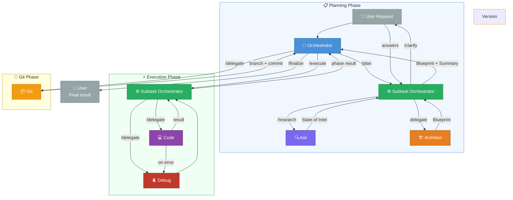
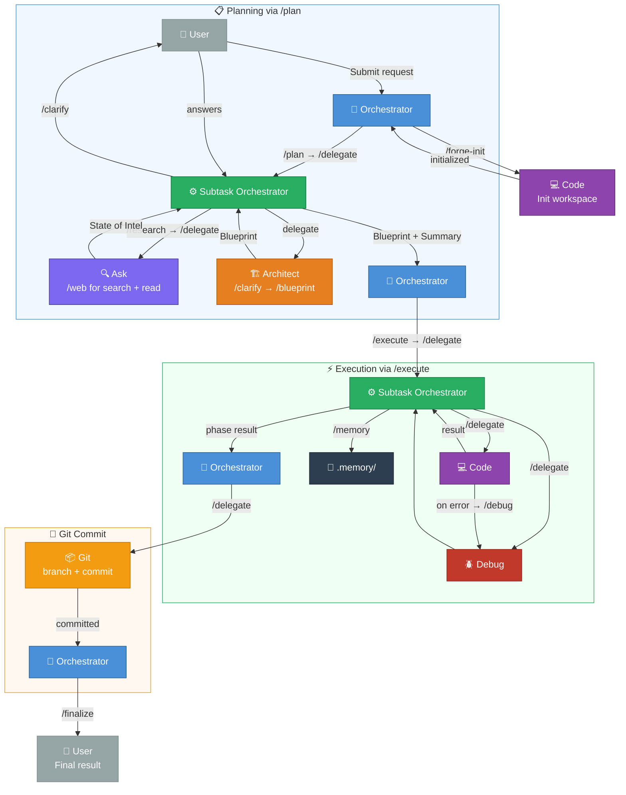

<div align="center">

# 🎯 RooForge

**A structured multi-agent orchestration system for [Roo Code](https://github.com/RooCodeInc/Roo-Code)**

A hierarchical pipeline of specialized AI modes — from strategic planning to atomic execution.

[](LICENSE)
[](../../releases/latest)
[](https://conventionalcommits.org)

</div>

---

**Jump to:** [Overview](#-overview) · [Pipeline](#-the-pipeline) · [Modes](#-modes) · [Commands](#-slash-commands) · [Installation](#-installation) · [MCP Servers](#-mcp-servers) · [Contributing](#-contributing)

---

## ⚠️ Prerequisites

Before installing, enable the **Run Slash Command** experimental feature in Roo Code — the entire pipeline depends on it:

1. Open Roo Code settings (gear icon)
2. Go to **Experimental Settings**
3. Enable **"Run Slash Command"**
4. Restart VS Code if prompted

> Without this setting, agents cannot execute `/plan`, `/delegate`, `/blueprint`, or any other slash command. See [run_slash_command docs](https://docs.roocode.com/advanced-usage/available-tools/run-slash-command) for details.

---

## 📋 Overview

This project provides a curated set of **custom mode export files**, **slash commands**, and a **Forge skill** that together define a disciplined, multi-layered agent orchestration workflow for Roo Code. Each mode is a specialist with a clearly defined role, connected by standardized commands that cascade into each other to eliminate duplication.

## 🔄 The Pipeline


```mermaid
flowchart TD
    User["👤 User Request"] --> O["🎯 Orchestrator"]

    subgraph Planning["📋 Planning Phase"]
        O -->|"/plan"| SO_P["⚙️ Subtask Orchestrator"]
        SO_P -->|"/clarify"| User
        User -->|"answers"| SO_P
        SO_P -->|"/research"| A["🔍 Ask"]
        A -->|"State of Intel"| SO_P
        SO_P -->|"delegate"| AR["🏗️ Architect"]
        AR -->|"Blueprint"| SO_P
        SO_P -->|"Blueprint + Summary"| O
    end

    subgraph Execution["⚡ Execution Phase"]
        O -->|"/execute"| SO_E["⚙️ Subtask Orchestrator"]
        SO_E -->|"/delegate"| C["💻 Code"]
        SO_E -->|"/delegate"| D["🪲 Debug"]
        C -->|"result"| SO_E
        C -->|"on error"| D
        D --> SO_E
        SO_E -->|"phase result"| O
    end

    subgraph Version Control["🔀 Git Phase"]
        O -->|"/delegate"| G["📦 Git"]
        G -->|"branch + commit"| O
    end

    O -->|"/finalize"| User2["👤 User<br/>Final result"]

    style O fill:#4A90D9,color:#fff,stroke:#2C5F8A
    style SO_P fill:#27AE60,color:#fff,stroke:#1A7A42
    style SO_E fill:#27AE60,color:#fff,stroke:#1A7A42
    style A fill:#7B68EE,color:#fff,stroke:#4B3F8A
    style AR fill:#E67E22,color:#fff,stroke:#A05A15
    style C fill:#8E44AD,color:#fff,stroke:#5B2D6E
    style D fill:#C0392B,color:#fff,stroke:#8A2520
    style G fill:#F39C12,color:#fff,stroke:#B8750E
    style User fill:#95A5A6,color:#fff,stroke:#7F8C8D
    style User2 fill:#95A5A6,color:#fff,stroke:#7F8C8D
    style Planning fill:#f0f7ff,stroke:#4A90D9,stroke-width:1px,color:#333
    style Execution fill:#f0fff4,stroke:#27AE60,stroke-width:1px,color:#333
    style Version Control fill:#fff8f0,stroke:#F39C12,stroke-width:1px,color:#333
```

### Pipeline Phases

| Phase | Mode | Purpose |
|-------|------|---------|
| **1 - Plan** | Subtask Orchestrator | Clarify scope, research intel, delegate to architect for Blueprint |
| **2 - Execute** | Subtask Orchestrator | Decompose Blueprint tasks into atomic subtasks for Code/Debug |
| **3 - Commit** | Git | Branch setup (if on main), pull/sync, conventional commit |

### Working Memory

All modes share `.memory/` as working memory — gitignored, local only. Read via `codebase_search`, write via `/memory`.

| File Pattern | Purpose | Behavior |
|-------------|---------|----------|
| `.memory/phase-{N}-{name}.md` | One file per Blueprint phase | Append only — never duplicate |
| `.memory/research-{topic}-{date}.md` | One file per research run (ask mode) | New file per topic |
| `.memory/blocker-{desc}.md` | One file per blocker | Standalone, resolvable |
| `.memory/memory.md` | General fallback (no phase context) | Append only |
| `.memory/blueprint-{date}.md` | Auto-created by `/blueprint` | Overwrite if same date |

## 🤖 Modes

| Mode | File | Description |
|------|------|-------------|
| **Orchestrator** | [`agents/orchestrator-export.yaml`](agents/orchestrator-export.yaml) | Strategic entry point. Navigates Blueprint phases, delegates to subtask-orchestrator, and commits after each phase via Git. |
| **Ask** | [`agents/ask-export.yaml`](agents/ask-export.yaml) | Intelligence specialist. Performs web research, codebase analysis, and generates "State of Intel" reports. |
| **Architect** | [`agents/architect-export.yaml`](agents/architect-export.yaml) | Technical leader. Creates detailed blueprints, system designs, and structured plans from gathered intelligence. |
| **Subtask Orchestrator** | [`agents/subtask-orchestrator-export.yaml`](agents/subtask-orchestrator-export.yaml) | Dual-role specialist. (1) Planning: coordinates clarify → research → architect to produce Blueprint. (2) Execution: decomposes tasks into atomic subtasks for Code/Debug. |
| **Code** | [`agents/code-export.yaml`](agents/code-export.yaml) | Implementation specialist. Writes, modifies, and refactors code. Delegates errors to Debug mode. |
| **Git** | [`agents/git-export.yaml`](agents/git-export.yaml) | Version control specialist. Handles branch creation (on main), pull/sync, conventional commits with user identity. |

## ⚡ Slash Commands

Standardized tool call formats that cascade into each other, eliminating duplication across agent files.

### Base Commands

| Command | Purpose |
|---------|---------|
| `/complete` | `attempt_completion` format — run when work is done |
| `/delegate` | `new_task` format — run before delegating to any mode |

### Flow Commands

| Command | Purpose | Used By |
|---------|---------|---------|
| `/clarify` | User clarification via `ask_followup_question` (loads grill-me) | Architect, Subtask Orchestrator |
| `/blueprint` | Phased planning methodology — phases with individual tasks | Architect |
| `/planning` | Full planning lifecycle — clarify, research, architect, Blueprint | Subtask Orchestrator |
| `/finalize` | Human-readable final output | Orchestrator |

### Tool Commands

| Command | Purpose | Used By |
|---------|---------|---------|
| `/web` | Web search + URL reader via SearXNG MCP | Ask |
| `/git` | Git operations (MCP-first, CLI fallback) | Git |

### Delegation Commands (cascade to `/delegate`)

| Command | Target Mode | Purpose |
|---------|-------------|---------|
| `/research` | `ask` | Intel gathering |
| `/plan` | `subtask-orchestrator` | Planning lifecycle (clarify → research → architect → Blueprint) |
| `/execute` | `subtask-orchestrator` | Phase-based task execution |
| `/debug` | `debug` | Error resolution |
| `/memory` | self (direct edit) | Phase-based memory persistence |
| `/forge-init` | `code` | Project initialization |

See the **Slash Commands** section above for the command tables and cascading architecture.

## 🧠 Forge Skill + Caveman

All modes load two skills on startup:

1. **[`skills/forge/SKILL.md`](skills/forge/SKILL.md)** — Pipeline orientation: flow, command registry, mode roles, conventions
2. **[`skills/caveman/SKILL.md`](skills/caveman/SKILL.md)** — Token-efficient communication (auto-loaded by forge skill, full intensity)

### Context-Triggered Skills

| Skill | Trigger | Purpose |
|-------|---------|---------|
| **[`skills/grill-me/SKILL.md`](skills/grill-me/SKILL.md)** | `/clarify` command | Relentless user interview — stress-test every design decision until shared understanding reached. **Mandatory** on every `/clarify` invocation. ([source](https://github.com/mattpocock/skills/blob/main/skills/productivity/grill-me/SKILL.md)) |
| **[`skills/planning-and-task-breakdown/SKILL.md`](skills/planning-and-task-breakdown/SKILL.md)** | `/blueprint` command | Structured planning methodology for phased task breakdown. |

## 🧩 Mode Interaction Flow


```mermaid
flowchart TD
    U["👤 User"] -->|"Submit request"| O1["🎯 Orchestrator"]

    O1 -->|"/forge-init"| INIT["💻 Code<br/>Init workspace"]
    INIT -->|"initialized"| O1

    subgraph Planning["📋 Planning via /plan"]
        O1 -->|"/plan → /delegate"| SO_P["⚙️ Subtask Orchestrator"]
        SO_P -->|"/clarify"| U
        U -->|"answers"| SO_P
        SO_P -->|"/research → /delegate"| A["🔍 Ask<br/>/web for search + read"]
        A -->|"State of Intel"| SO_P
        SO_P -->|"delegate"| AR["🏗️ Architect<br/>/clarify → /blueprint"]
        AR -->|"Blueprint"| SO_P
        SO_P -->|"Blueprint + Summary"| O2["🎯 Orchestrator"]
    end

    subgraph Execution["⚡ Execution via /execute"]
        O2 -->|"/execute → /delegate"| SO_E["⚙️ Subtask Orchestrator"]
        SO_E -->|"/delegate"| C["💻 Code"]
        SO_E -->|"/delegate"| D["🪲 Debug"]
        C -->|"result"| SO_E
        C -->|"on error → /debug"| D
        D --> SO_E
        SO_E -->|"/memory"| M["💾 .memory/"]
        SO_E -->|"phase result"| O3["🎯 Orchestrator"]
    end

    subgraph Git["🔀 Git Commit"]
        O3 -->|"/delegate"| G["📦 Git<br/>branch + commit"]
        G -->|"committed"| O4["🎯 Orchestrator"]
    end

    O4 -->|"/finalize"| U2["👤 User<br/>Final result"]

    style U fill:#95A5A6,color:#fff,stroke:#7F8C8D
    style U2 fill:#95A5A6,color:#fff,stroke:#7F8C8D
    style O1 fill:#4A90D9,color:#fff,stroke:#2C5F8A
    style O2 fill:#4A90D9,color:#fff,stroke:#2C5F8A
    style O3 fill:#4A90D9,color:#fff,stroke:#2C5F8A
    style O4 fill:#4A90D9,color:#fff,stroke:#2C5F8A
    style INIT fill:#8E44AD,color:#fff,stroke:#5B2D6E
    style SO_P fill:#27AE60,color:#fff,stroke:#1A7A42
    style SO_E fill:#27AE60,color:#fff,stroke:#1A7A42
    style A fill:#7B68EE,color:#fff,stroke:#4B3F8A
    style AR fill:#E67E22,color:#fff,stroke:#A05A15
    style C fill:#8E44AD,color:#fff,stroke:#5B2D6E
    style D fill:#C0392B,color:#fff,stroke:#8A2520
    style G fill:#F39C12,color:#fff,stroke:#B8750E
    style M fill:#2C3E50,color:#fff,stroke:#1A252F
    style Planning fill:#f0f7ff,stroke:#4A90D9,stroke-width:1px,color:#333
    style Execution fill:#f0fff4,stroke:#27AE60,stroke-width:1px,color:#333
    style Git fill:#fff8f0,stroke:#F39C12,stroke-width:1px,color:#333
```

## 🚀 Installation

### Install / Update (CLI)

```bash
git clone https://github.com/weselben/RooForge.git
cd RooForge
mkdir -p ~/.roo/commands ~/.roo/skills
cp -rf commands/* ~/.roo/commands/
# Only remove known RooForge skills — never rm -rf ~/.roo/skills/* to protect user-installed skills
rm -rf ~/.roo/skills/caveman ~/.roo/skills/forge ~/.roo/skills/grill-me ~/.roo/skills/planning-and-task-breakdown
cp -rf skills/* ~/.roo/skills/
```

To install a **specific version**, clone by tag instead:

```bash
git clone --branch v1.2.3 --depth 1 https://github.com/weselben/RooForge.git
cd RooForge
mkdir -p ~/.roo/commands ~/.roo/skills
cp -rf commands/* ~/.roo/commands/
# Only remove known RooForge skills — never rm -rf ~/.roo/skills/* to protect user-installed skills
rm -rf ~/.roo/skills/caveman ~/.roo/skills/forge ~/.roo/skills/grill-me ~/.roo/skills/planning-and-task-breakdown
cp -rf skills/* ~/.roo/skills/
```

> **Why remove specific skills, not all?** The `rm -rf` targets only known RooForge skills (`caveman`, `forge`, `grill-me`, `planning-and-task-breakdown`). This prevents accidental deletion of user-installed skills (e.g. via `npx skills add` or manual installs). If you add a new skill to this repo, **you must add it to the `rm -rf` line** in both install commands above.
>
> See [Roo Code Slash Commands docs](https://docs.roocode.com/features/slash-commands) and [Skills docs](https://docs.roocode.com/features/skills) for details on global directories.

### Import Agent Modes

1. **Download** the export YAML files from the [latest release](../../releases/latest).
2. Open **Roo Code** in VS Code.
3. Navigate to **Roo Code Settings → Custom Modes**.
4. Click **Import** and select the downloaded `.yaml` file(s).
5. The modes will appear in your mode selector.

> **Tip:** Import all six modes for the full orchestration pipeline experience.

### Configure MCP Servers

See [**MCP Servers**](#-mcp-servers) below for required server setup.

## 🔄 Automated Releases

This repository uses **automated semantic versioning** powered by [Conventional Commits](https://www.conventionalcommits.org/):


```mermaid
flowchart LR
    P["⬆️ Push to main"] --> W["⚙️ GitHub Actions Workflow"]
    W --> V["🔢 Compute next version<br/>from commit messages"]
    V --> T["🏷️ Create git tag<br/>(e.g. v1.2.3)"]
    T --> R["🚀 Publish GitHub Release<br/>with YAML assets"]

    style P fill:#95A5A6,color:#fff,stroke:#7F8C8D
    style W fill:#4A90D9,color:#fff,stroke:#2C5F8A
    style V fill:#E67E22,color:#fff,stroke:#A05A15
    style T fill:#27AE60,color:#fff,stroke:#1A7A42
    style R fill:#8E44AD,color:#fff,stroke:#5B2D6E
```

### Commit Convention

| Prefix | Version Bump | Example |
|--------|-------------|---------|
| `feat:` | **Minor** | `feat: add debug mode export` |
| `fix:` | **Patch** | `fix: correct orchestrator role definition` |
| `feat!:` or `BREAKING CHANGE` | **Major** | `feat!: redesign pipeline architecture` |
| `docs:` | None | `docs: update README` |
| `chore:` | None | `chore: update workflow` |
| `refactor:` | None | `refactor: simplify subtask logic` |
| `test:` | None | `test: add validation for exports` |

## 🪨 Caveman — Token-Efficient Communication

[Caveman](https://github.com/JuliusBrussee/caveman) enforces ultra-terse communication across the entire orchestration stack. Cuts ~65% of output tokens while keeping full technical accuracy. **Auto-loaded** by the Forge skill on startup** — installed as part of the skills directory (see Installation step 3).

**Manual install (if not using the skills directory):**
```bash
npx skills add JuliusBrussee/caveman
# Select "Roo Code" when prompted
```

Caveman defaults to **full** intensity. Switch levels anytime: "caveman ultra", "caveman lite", "stop caveman".

## 🔌 MCP Servers

The orchestration pipeline requires two MCP (Model Context Protocol) servers for full functionality. These servers extend the capabilities of specific modes in the pipeline.

| Server | Required By | Purpose |
|--------|-------------|---------|
| **SearXNG** | Ask | Web search & URL reading |
| **Git MCP** | Git | Git operations (CLI fallback) |

> 💡 See [`mcp.md`](mcp.md) for full setup instructions, configuration details, and usage examples.

## 📁 Repository Structure

```
.
├── .github/
│   ├── workflows/
│   │   └── release.yml              # Auto-versioning & release workflow
│   └── ISSUE_TEMPLATE/              # Bug reports, features, questions
├── agents/
│   ├── orchestrator-export.yaml     # Orchestrator mode
│   ├── subtask-orchestrator-export.yaml  # Subtask Orchestrator mode
│   ├── architect-export.yaml        # Architect mode
│   ├── ask-export.yaml              # Ask (research) mode
│   ├── code-export.yaml             # Code (implementation) mode
│   └── git-export.yaml              # Git mode
├── commands/
│   ├── complete.md                  # /complete — attempt_completion format (includes blocked variant)
│   ├── delegate.md                  # /delegate — new_task format
│   ├── clarify.md                   # /clarify — user clarification protocol
│   ├── blueprint.md                 # /blueprint — phased planning methodology
│   ├── planning.md                  # /planning — SO planning lifecycle (clarify → research → architect)
│   ├── finalize.md                  # /finalize — human-readable output
│   ├── web.md                       # /web — web search + URL reader
│   ├── git.md                       # /git — git operations (MCP + CLI + branch setup)
│   ├── research.md                  # /research — intel delegation
│   ├── plan.md                      # /plan — routing to SO for planning
│   ├── execute.md                   # /execute — phase-based task execution
│   ├── debug.md                     # /debug — error resolution
│   ├── memory.md                    # /memory — phase-based memory persistence
│   └── forge-init.md                # /forge-init — project initialization
├── skills/
│   ├── forge/
│   │   ├── README.md                # Forge skill overview
│   │   └── SKILL.md                 # Pipeline orientation skill
│   ├── caveman/
│   │   └── SKILL.md                 # Token-efficient communication skill
│   └── planning-and-task-breakdown/
│       └── SKILL.md                 # Planning methodology skill
├── mcp.md                          # MCP server configuration (SearXNG + Git MCP)
├── CONTRIBUTING.md                  # Contribution guidelines
├── LICENSE                          # Apache License 2.0
└── README.md                        # This file
```

## 🤝 Contributing

We welcome community involvement! However, please note that **pull requests are not automatically accepted**. All contributions go through an evaluation process.

See [**CONTRIBUTING.md**](CONTRIBUTING.md) for full details on:
- Our PR evaluation process
- Conventional Commits (extended) requirements
- Feature branch workflow
- Testing expectations

## 📄 License

Licensed under the [Apache License 2.0](LICENSE).

```
Copyright 2026 weselben

Licensed under the Apache License, Version 2.0 (the "License");
you may not use this file except in compliance with the License.
You may obtain a copy of the License at

    http://www.apache.org/licenses/LICENSE-2.0

Unless required by applicable law or agreed to in writing, software
distributed under the License is distributed on an "AS IS" BASIS,
WITHOUT WARRANTIES OR CONDITIONS OF ANY KIND, either express or implied.
See the License for the specific language governing permissions and
limitations under the License.
```

## ⭐ Acknowledgments

- Built for [Roo Code](https://github.com/RooCodeInc/Roo-Code) - an AI-powered coding assistant for VS Code.
- Inspired by hierarchical task decomposition and multi-agent orchestration patterns.
- [Caveman](https://github.com/JuliusBrussee/caveman) by JuliusBrussee - token-efficient communication skill for AI agents.

---

<div align="center">

**[⬆ Back to top](#-rooforge)**

</div>
