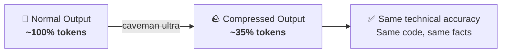

<div align="center">

# 🪨 Caveman Addon

**Token-efficient communication for the orchestration stack**

[](https://github.com/JuliusBrussee/caveman)
[](https://github.com/JuliusBrussee/caveman)

*Optional addon · Same info · Fraction of the tokens*

</div>

---

## 💡 The Idea

Our orchestration stack has 5 modes passing context back and forth via `new_task` and `attempt_completion`. Each handoff generates prose - intel reports, blueprints, context envelopes, state chains. That prose burns tokens fast.

[Caveman](https://github.com/JuliusBrussee/caveman) fixes this. It strips all linguistic filler while keeping every technical detail intact. The result: the same information in a fraction of the tokens.



## 👀 What It Looks Like

Here is the same Orchestrator output, with and without caveman ultra:

<table>
<tr>
<th>❌ Without Caveman</th>
<th>✅ With Caveman Ultra</th>
</tr>
<tr>
<td>

```
I've received the State of Intel report
from the Ask mode. Based on the findings,
I can now see that the project uses
Express.js v4.18 with Prisma ORM and
PostgreSQL. The existing API follows
RESTful conventions under /api/v1/* with
authentication middleware applied to all
routes.

I will now decompose this into task groups
for the Subtask Orchestrator to execute
sequentially.
```

</td>
<td>

```
Intel received. Express v4.18 + Prisma
+ PostgreSQL. REST /api/v1/*. Auth
middleware on all routes.
Decomposing into TGs now.
```

</td>
</tr>
</table>

> **Same information. Fraction of the tokens. Every technical detail preserved.**

### Per-Mode Examples

**🔍 Ask - State of Intel report:**

| Without | With Ultra |
|---------|-----------|
| "The database connection is managed through Prisma ORM, which provides a type-safe query builder. The schema file is located at `prisma/schema.prisma` and currently defines a User model with id, email, and createdAt fields." | "DB: Prisma ORM. Schema: `prisma/schema.prisma`. User model: id, email, createdAt." |

**🏗️ Architect - Blueprint task group:**

| Without | With Ultra |
|---------|-----------|
| "Task Group 2 is responsible for implementing the API route and controller. The objective is to create a GET endpoint at /api/v1/user/preferences that returns the user's preference settings. This depends on TG-1 being completed first since the Preferences model must exist in the database." | "TG-2: GET /api/v1/user/preferences. Return user prefs. Deps: TG-1 (model must exist)." |

**⚙️ Subtask Orchestrator - State chain:**

| Without | With Ultra |
|---------|-----------|
| "Context Chain: First I delegated the schema creation task to Code mode, then Code mode successfully added the Preferences model, and currently I am preparing to dispatch the migration task." | "Chain: schema created → model added → dispatching migration." |

## 🚀 Setup

### Step 1: Install Caveman

```bash
npx skills add JuliusBrussee/caveman -a roo
```

> 💡 Other agents: `amp`, `goose`, `kiro-cli`, `opencode`, and 40+ more.
> Uninstall: `npx skills remove caveman`
> Windows: add `--copy` if symlinks fail.

### Step 2: Enable Ultra Mode

Caveman defaults to `full`. Switch to **ultra** (our tested mode) by saying:

> **"caveman ultra"**

### Step 3 (Optional): Always-On

To make caveman ultra persist across **all** sessions and `new_task` delegations, paste this into:

> **Roo Code → Settings → Custom Modes → Global Custom Instructions**

```
GLOBAL VITAL MANDATES: 

- CAVEMAN ULTRA - ACTIVE EVERY RESPONSE.
- Drop: articles, filler, pleasantries, hedging. Fragments OK.
- Short synonyms. Technical terms exact. Code unchanged.
- Abbreviate (DB/auth/config/req/res/fn/impl). Arrows for causality.
- Pattern: [thing] [action] [reason]. [next step].
- Tool calls: clear caveman lite (fallback to caveman Off). attempt_completion: caveman full
- Security warnings: clear caveman lite. Resume after in caveman ultra!
- ACTIVE EVERY RESPONSE. No revert. No filler drift.
- Off: "stop caveman" / "normal mode".

Please review any active SKILLs!
```

Or create `.roo/rules/caveman.md` in your project root with the same content.

<details>
<summary>📖 Why does this need to be global?</summary>

Mode-specific settings do **not** propagate to `new_task` delegations. Each `new_task` spawns a fresh context. Rules files and Global Custom Instructions are the only mechanisms that persist across all mode switches in Roo Code.

</details>

### EXPERIMENTAL - REASONING COMPRESSION (NOT WORKING)

**Status**: NOT WORKING - Experimental feature, do not use in production.

Add this to your Global Custom Instructions to enable compressed reasoning:

```markdown
REASONING CAVEMAN (FULL):
- REASON IN CAVEMAN FULL MODE - Internal thinking/reasoning uses caveman full skill.
- No verbose chain-of-thought. Direct reasoning paths only.
- Skip obvious deduction steps. Jump to conclusions when confidence high.
- Reduce thinking about the same thing repeatedly! DO NOT think trivial!
- ACTIVE EVERY REASONING alongside caveman ultra response.
```

**Note**: This is experimental and currently not working as expected.

## 📊 Impact on the Stack

| Mode | What Changes |
|------|-------------|
| 🎯 **Orchestrator** | Dense context envelopes, compact task group definitions |
| 🔍 **Ask** | Compressed intel reports, key facts only |
| 🏗️ **Architect** | Tight blueprint specs, no filler |
| ⚙️ **Subtask Orchestrator** | Brief subtask instructions, terse state chains |
| 📦 **Git** | Minimal change (conventional commits already terse) |

## 🔧 Other Levels

Caveman supports `lite`, `full`, `ultra`, `wenyan-lite`, `wenyan-full`, and `wenyan-ultra`. We only tested **ultra** with this stack. Other levels may work but are untested. Switch anytime by saying the level name.

## 🔗 Links

- **Caveman:** [github.com/JuliusBrussee/caveman](https://github.com/JuliusBrussee/caveman)

---

<div align="center">

*[⬆ Back to README](../README.md)*

</div>
