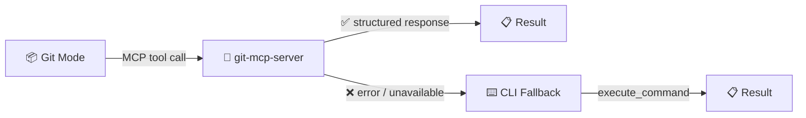

<div align="center">

# 📦 Git MCP Server

**Git operations via MCP for Git mode**

[](https://github.com/anthropics/git-mcp-server)
[](https://www.npmjs.com/package/@anthropic/git-mcp-server)

*Structured git access · MCP-first · CLI fallback*

</div>

---

## 💡 The Idea

Git mode handles version control for the entire orchestration pipeline — commits, branches, merges, tags. It can do this two ways: via MCP tools (structured, typed, validated) or via raw CLI commands.

The MCP-first approach is preferred. Every `git_*` MCP tool returns structured responses with clear success/failure states. No parsing CLI output. No escaping edge cases. When MCP fails or a tool doesn't exist, CLI is the fallback.



## 🔧 Available Tools

| # | Tool | Purpose |
|---|------|---------|
| 1 | `git_add` | Stage files for commit |
| 2 | `git_blame` | Line-by-line authorship info |
| 3 | `git_branch` | List, create, delete, rename branches |
| 4 | `git_changelog_analyze` | Changelog analysis with git history context |
| 5 | `git_checkout` | Switch branches or restore files |
| 6 | `git_cherry_pick` | Apply specific commits to current branch |
| 7 | `git_clean` | Remove untracked files |
| 8 | `git_clear_working_dir` | Clear session working directory |
| 9 | `git_clone` | Clone a remote repository |
| 10 | `git_commit` | Create commit with staged changes |
| 11 | `git_diff` | View differences between commits/branches/tree |
| 12 | `git_fetch` | Download objects/refs from remote |
| 13 | `git_init` | Initialize a new git repository |
| 14 | `git_log` | View commit history with filtering |
| 15 | `git_merge` | Merge branches together |
| 16 | `git_pull` | Fetch and integrate remote changes |
| 17 | `git_push` | Push local commits to remote |
| 18 | `git_rebase` | Rebase commits onto another branch |
| 19 | `git_reflog` | View reference logs for recovery |
| 20 | `git_remote` | Manage remote repositories |
| 21 | `git_reset` | Reset HEAD to specified state |
| 22 | `git_set_working_dir` | Set session working directory |
| 23 | `git_show` | Show details of git objects |
| 24 | `git_stash` | Save, restore, or remove stashes |
| 25 | `git_status` | Show working tree status |
| 26 | `git_tag` | List, create, or delete tags |
| 27 | `git_worktree` | Manage multiple working trees |

<details>
<summary>📖 Categorized Tool Reference</summary>

### Staging & Committing

| Tool | Description |
|------|-------------|
| `git_add` | Stage files for the next commit. Supports `--update`, `--all`, `--force` flags. |
| `git_commit` | Create a commit from staged changes. Supports `--amend`, `--allow-empty`, `--sign`, `--no-verify`. |
| `git_reset` | Reset HEAD to a specified state. Modes: `soft` (keep staged), `mixed` (unstage), `hard` (discard all). |
| `git_stash` | Manage stashes: `push` (save), `pop` (restore + drop), `apply` (restore), `drop`, `clear`. |

### Branching & Merging

| Tool | Description |
|------|-------------|
| `git_branch` | List, create, delete, or rename branches. Supports `--all`, `--remote`, `--merged`, `--no-merged`. |
| `git_checkout` | Switch branches, create new branches, or restore specific file paths. |
| `git_cherry_pick` | Apply specific commits from other branches. Supports `--no-commit`, `--continue`, `--abort`. |
| `git_merge` | Merge branches with strategies: `ort`, `recursive`, `octopus`, `ours`, `subtree`. Supports `--squash`, `--no-ff`. |
| `git_rebase` | Rebase commits onto another base. Modes: `start`, `continue`, `abort`, `skip`. |

### Inspection

| Tool | Description |
|------|-------------|
| `git_blame` | Show line-by-line authorship with date and commit info. Supports line range and whitespace ignore. |
| `git_diff` | View diffs between commits, branches, or working tree. Supports `--staged`, `--stat`, `--name-only`. |
| `git_log` | View commit history. Filter by author, date, file path, or message pattern. Supports `--oneline`, `--patch`. |
| `git_reflog` | Track when branch tips and references were updated. Useful for recovering lost commits. |
| `git_show` | Show details of git objects (commits, trees, blobs, tags). Supports `--stat`, `--raw`. |
| `git_status` | Show staged, unstaged, and untracked files in the working tree. |
| `git_changelog_analyze` | Gather git history context and structured review instructions for changelog analysis. |

### Remote & Sync

| Tool | Description |
|------|-------------|
| `git_fetch` | Download objects and refs from remote. Supports `--prune`, `--tags`, `--depth`. |
| `git_pull` | Fetch and integrate changes. Supports `--rebase`, `--fast-forward-only`. |
| `git_push` | Push local commits to remote. **Disabled in this stack** (see below). |
| `git_remote` | List, add, remove, rename remotes. Get/set remote URLs. |

### Repository Management

| Tool | Description |
|------|-------------|
| `git_clean` | Remove untracked files/directories. Supports `--dry-run`, `--force`, `--ignored`. |
| `git_clone` | Clone from remote URL. Supports `--bare`, `--mirror`, `--depth`, `--branch`. |
| `git_init` | Initialize a new git repository. Supports `--bare`, `--initial-branch`. |
| `git_tag` | List, create (annotated/signed), or delete tags. |
| `git_worktree` | Manage multiple working trees: `list`, `add`, `remove`, `move`, `prune`. |

### Session & Workflow

| Tool | Description |
|------|-------------|
| `git_set_working_dir` | Set the session working directory for all subsequent git operations. |
| `git_clear_working_dir` | Clear the session working directory. Subsequent ops require explicit paths. |

</details>

## ⚠️ Disabled Tools

| Tool | Status | Reason |
|------|--------|--------|
| `git_push` | 🔴 **DISABLED** | Safety: prevents accidental pushes to remote. Push manually via CLI when ready. |

> **Why?** The orchestration pipeline commits locally but does not auto-push. This is intentional — push is a destructive remote operation that should be explicitly confirmed by the user. Git mode will stage and commit all changes, then instruct the user to push manually when ready.

## 🚀 Setup

### Step 1: Configure MCP Server

Add to your Roo Code MCP settings (`~/.config/Code - OSS/User/globalStorage/rooveterinaryinc.roo-cline/settings/mcp_settings.json`):

```json
{
  "mcpServers": {
    "git-mcp-server": {
      "command": "bunx",
      "args": ["-y", "@anthropic/git-mcp-server"],
      "alwaysAllow": [
        "git_add",
        "git_blame",
        "git_branch",
        "git_changelog_analyze",
        "git_checkout",
        "git_cherry_pick",
        "git_clean",
        "git_clear_working_dir",
        "git_clone",
        "git_commit",
        "git_diff",
        "git_fetch",
        "git_init",
        "git_log",
        "git_merge",
        "git_pull",
        "git_rebase",
        "git_reflog",
        "git_remote",
        "git_reset",
        "git_set_working_dir",
        "git_show",
        "git_stash",
        "git_status",
        "git_tag",
        "git_worktree"
      ]
    }
  }
}
```

> ⚠️ Note: `git_push` is intentionally excluded from `alwaysAllow`. See [Disabled Tools](#️-disabled-tools) above.

### Step 2: Verify

1. Restart Roo Code
2. Switch to **Git mode**
3. Run a `git_status` call
4. Confirm structured response from `git-mcp-server`

<details>
<summary>📖 What does `alwaysAllow` do? And why is `git_push` excluded?</summary>

By default, Roo Code asks for confirmation before each MCP tool call. Adding tool names to `alwaysAllow` skips confirmation for those tools. This is recommended for git operations since Git mode performs many sequential operations (status → add → commit → tag) and confirmation prompts would break the workflow.

**`git_push` is excluded** because pushing to a remote is a destructive, public-facing operation. The orchestration pipeline is designed to commit locally and let the user push manually when they've reviewed the changes. This prevents accidental pushes of incomplete or incorrect work.

If you want to enable `git_push` in `alwaysAllow`, add it to the array — but understand the risks.

</details>

## 📊 Impact on the Stack

| Mode | Role | Access |
|------|------|--------|
| 🎯 **Orchestrator** | Delegates to Git mode after each task completes | Indirect (via Git) |
| 🔍 **Ask** | Intel gathering, no git operations | None |
| 🏗️ **Architect** | Blueprint authoring, no git operations | None |
| ⚙️ **Subtask Orchestrator** | Executes tasks, no git operations | None |
| 📦 **Git** | Primary consumer — all git operations via MCP | **Direct** |

## 🔗 Links

- **git-mcp-server:** [github.com/anthropics/git-mcp-server](https://github.com/anthropics/git-mcp-server)
- **npm package:** [npmjs.com/package/@anthropic/git-mcp-server](https://www.npmjs.com/package/@anthropic/git-mcp-server)

---

<div align="center">

*[⬆ Back to README](../README.md)*

</div>
