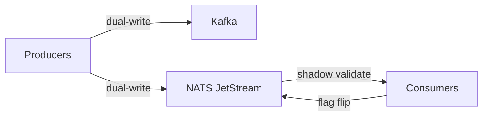

# PR Examples — worked examples for creating-pull-requests

Full template and additional examples live here so `SKILL.md` stays lean. Load this when drafting medium/large PRs.

---

## Complete template

```markdown
## TL;DR

[Two sentences. First: problem with concrete number/error/example. Second: what the PR does.]

**Files to review (N, +X / -Y):**

| File | Why |
|---|---|
| `path/to/start_here.py` *(start here)* | One-line pointer to the natural entry point. |
| `path/to/other.py` | Short reason this file changed. |

## Why

[Why the PR exists. Before/after table or screenshot if visual/numeric. Skip when TL;DR covers it.]

## How

[Design decisions, not line-by-line. Numbered for sequential; bullets for parallel.]

## Reviewer notes

- **Headline.** Detail. End with focus-area if needed.

## Visual aids

[Before/after tables, mermaid, code snippets, screenshots — only when faster than prose.]

## Tests

[What's covered, what isn't, how to run.]

## Follow-up

[Out-of-scope work this PR sets up. Only if deliberately incomplete.]

## Links

- [Ticket](url)
- [Slack thread](url)

---

_This PR description was generated with AI assistance._
```

---

## Additional worked examples

### Medium: new feature with config

```
Title: Add retry policy configuration to ingestion pipeline

## TL;DR

Ingestion jobs with transient failures currently hard-crash — no retry
mechanism exists. Adds `RetryPolicy` config (max_attempts, backoff_base,
retryable_errors) and wires it into the job runner. Default: 3 attempts,
exponential backoff, retries `ServiceUnavailable` and `Timeout`.

**Files to review (4, +112 / -8):**

| File | Why |
|---|---|
| `ingestion/config.py` *(start here)* | `RetryPolicy` dataclass + defaults. |
| `ingestion/runner.py` | Wraps job execution in retry loop. |
| `tests/ingestion/test_retry.py` *(new)* | 8 tests: success, retry, max-attempts, non-retryable. |
| `config/examples/ingestion.yaml` | Example config with retry section. |

## Why

| Scenario | Before | After |
|---|---|---|
| Transient GCS timeout | Job crashes, manual re-run | Auto-retries, succeeds on 2nd |
| Transient Bigtable latency | Job crashes | Auto-retries, succeeds on 3rd |

## How

1. Parse `RetryPolicy` from config (fallback to defaults).
2. Wrap `run_job()` in `with_retry(policy, fn)`.
3. `with_retry` catches `retryable_errors`, waits `backoff_base * 2^attempt`.

## Reviewer notes

- **Non-retryable errors propagate immediately.** `InvalidArgument` and auth errors don't retry.
- **No jitter in backoff** — intentional; add if production shows thundering-herd.
- **Focus area:** backoff math handles `attempt=0` correctly (base * 1).

## Tests

- Unit: `RetryPolicy` defaults, `with_retry` success/retry/exhaustion.
- Integration: simulated transient failure recovers; non-retryable fails fast.

## Links

- [DIFF-3456](url)
```

---

### Large: architectural migration

```
Title: Migrate event store from Kafka to NATS JetStream

## TL;DR

Kafka event store creates operational burden (ZooKeeper, partition rebalancing,
replication lag). NATS JetStream gives native streaming with embedded config,
simpler scaling, and lower latency. Migrates 12 producers and 8 consumers;
dual-write period with shadow validation. 0-downtime cutover.

**Files to review (27, +4,200 / -3,800):**

| File | Why |
|---|---|
| `events/store/nats.go` *(start here)* | JetStream consumer/producer, codec, ack policy. |
| `events/store/kafka.go` | Deprecated — kept for dual-write. |
| `events/producer.go` | Dual-write: write to both, validate shadow. |
| `events/consumer.go` | Switchable consumer: kafka | nats. |
| `config/events.yaml` | New `jetstream` section, migration flags. |
| `k8s/events/jetstream.yaml` | NATS cluster, stream, consumer config. |

## Why

| Metric | Kafka (current) | NATS JetStream (target) |
|---|---|---|
| End-to-end latency (p99) | 180 ms | 25 ms |
| Operational components | 3 (broker, zk, connect) | 1 (NATS) |
| Cutover time | N/A | < 30 sec (flag flip) |
| Annual ops cost | $42K | $18K |

## How

1. Deploy NATS cluster, create streams/consumers.
2. Dual-write: producers write to Kafka + NATS; consumers shadow-validate.
3. Shadow validation: compare NATS output to Kafka truth for 2 weeks.
4. Flag flip: consumers read from NATS; dual-write stops.
5. Decommission Kafka after validation window.



## Reviewer notes

- **Cutover is a single flag flip.** `events.consumer.source: nats` in config.
- **Dual-write validates every event.** Mismatch = alert + block cutover.
- **No data loss:** Kafka retained until cutover + 7 days.
- **Focus area:** `events/producer.go` dual-write error handling — partial failure semantics.

> [!IMPORTANT]
> NATS stream retention: 7 days / 50 GB. Adjust before cutover if volume grows.

<details>
<summary>Migration checklist</summary>

- [ ] NATS cluster deployed
- [ ] Dual-write + shadow validation running 2+ weeks
- [ ] Zero mismatches for 7 consecutive days
- [ ] Rollback plan tested
- [ ] On-call briefed

</details>

## Links

- [DIFF-7890](url)
- [NATS JetStream docs](url)
- [Migration design doc](url)
```

---

### Small: docs-only

```
Title: Update README with new retry policy config

## TL;DR

Adds `RetryPolicy` section to ingestion config docs with all fields, defaults,
and a full example. No code changes.

[DIFF-1111](url)
```

That's it — TL;DR only. The diff is the documentation.